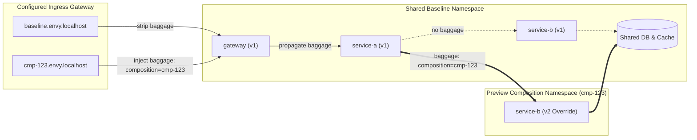
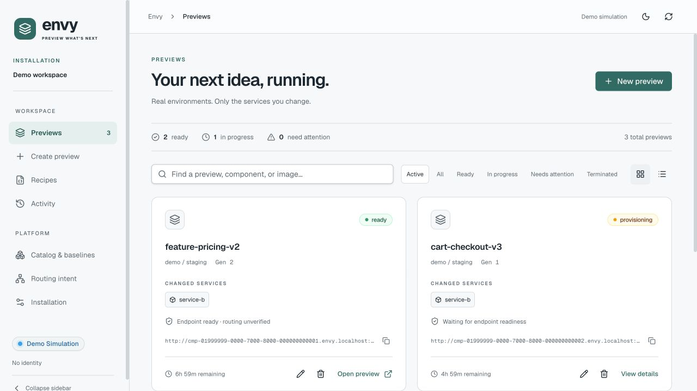

# Envy

> **Preview environments without copying the world.**  
> *Like Git branches, but for running microservices. Test distributed systems on demand by deploying only what you changed.*

[Documentation](https://dblooman.github.io/envy/) · [Contributing](CONTRIBUTING.md) · [Security](SECURITY.md)

[](LICENSE)
[](go.mod)
[](deploy/kubernetes/)
[](docs/mesh-installation.md)
[](cmd/mcp/)

---

## 🎯 What is Envy?

Imagine your application consists of 20 microservices: an API gateway, authentication, billing, search, notifications, caches, databases, and background workers.

You make a two-line bugfix in `service-b`. **How do you test it end-to-end before merging?**

| Traditional Approaches | The Problem |
| :--- | :--- |
| **Shared deployed baseline** | Everyone deploys to the same reference environment. If Alice breaks the shared baseline, Bob's testing is blocked. Deployments collide constantly. |
| **Full Environment Duplication** | Spin up all 20 services, databases, and message queues on every pull request. Requires provisioning and starting the entire application for each preview. |

### The Envy Way: Composable Virtual Environments

Instead of duplicating the world, Envy gives you **ephemeral virtual environments**:

$$\text{Environment} = \text{Deployed Reference Baseline} + \text{Selective Overrides}$$

- You only build and deploy the container you actually modified (e.g. `service-b:v2`).
- Envy allocates an isolated preview URL (e.g. `http://cmp-abc123.envy.localhost:8080`).
- When a request hits your preview URL, the selected mesh steers traffic through the shared baseline services, seamlessly diverting to your new `service-b:v2` override when that service is called.
- Everything else (unmodified services, shared databases, caches) is reused from the baseline!

---

## ✨ Why You'll Love It (The Outcome)

- ⚡ **Selective Deployment:** Deploy changed services while reusing a running reference baseline. Readiness depends on image pulls, scheduling, and application startup.
- 💰 **Shared Baseline:** Run only the needed override workloads per preview. Savings depend on the services and resources reused.
- 🔗 **Real Preview URLs:** Share live preview links with teammates, product managers, QA, or automated end-to-end browser tests before merging.
- 🤖 **AI-Agent Ready (MCP):** Comes with a built-in [Model Context Protocol (MCP)](https://modelcontextprotocol.io/) server. External AI agents (Claude Code, Cursor, Codex, GitHub Copilot) can create, inspect, test, and destroy preview environments autonomously.
- 🛡️ **Out-of-band Control Plane:** Envy configures your existing Istio, Cilium, or Linkerd mesh. Application traffic stays in that data plane; Envy does not proxy requests.

---

Choose a mesh using the [installation profiles](docs/mesh-installation.md). The production control-plane chart installs Envy; meshes and ingress remain operator-managed. The separate local quickstart chart bundles an evaluation stack. For Linkerd, Envy uses immutable, content-addressed producer routes because the pinned controller omits `observedGeneration` from route status.

## 🔍 How It Works

Envy combines a shared Kubernetes baseline with mesh request routing and W3C Baggage propagation:



1. **Ingress Entry:** When a request hits `http://cmp-<id>.envy.localhost:8080`, the configured ingress controller attaches a W3C `baggage: composition=<id>` header.
2. **Context Propagation:** Services pass standard W3C baggage downstream using OpenTelemetry instrumentation (`otelhttp`).
3. **Dynamic Mesh Routing:** Istio VirtualServices or Cilium/Linkerd Gateway API routes match the baggage header. If the header matches your composition ID, the request is directed to your override pod. Unmatched requests transparently route to the shared baseline.
4. **Independent Lifecycle:** When you're done, deleting the composition tears down the isolated namespace and routes; the shared baseline remains untouched.

---

## 🚀 Quickstart

For a local evaluation on a dedicated cluster, follow the [Local Quickstart](https://dblooman.github.io/envy/getting-started/local-quickstart/). Its released `envy-quickstart` Helm chart bundles Envy, Istio, PostgreSQL, and a sample tea-shop application; no source build or CLI is required.

For an existing Docker Desktop Kubernetes or remote cluster with your own database and mesh, see the [Helm installation reference](docs/installation.md). The released `envy-chart` installs the control plane with a bundled web UI, but not the mesh or database; the Envy CLI is optional.

For API-only testing from another laptop, use the [LAN installation guide](docs/lan-installation.md). The released operator installation uses your own PostgreSQL, mesh, DNS/TLS, and authentication configuration. The options below are source-based contributor workflows.

You can explore Envy right now using either the cluster-free Web UI simulator or the full local Kubernetes stack.

### Option A: Explore the Web UI in Simulation Mode (No Cluster Needed!)

Install Node 24.8+ (Node 24) and pnpm 10.20.0 first; see [contributor setup](CONTRIBUTING.md).

Want to test drive the dashboard without installing Kubernetes or Docker? The frontend includes a built-in simulation mode:

```sh
cd web
pnpm install --frozen-lockfile
pnpm dev
```

Open the address printed by Vite (normally **`http://localhost:5173`**) in your browser and select **Explore demo**. Once inside, the simulation switch is under **Installation → Demo**. Explore sample previews and the three-step creation flow; working endpoints, live diagnostics, and revision history require a connected installation.



Follow the [Web Interface walkthrough](https://dblooman.github.io/envy/guides/web-interface/) for screenshots and instructions for creating, opening, inspecting, and cleaning up previews.

---

### Option B: Full Local Development Stack (`make dev`)

Experience real request routing with a dedicated local [kind](https://kind.sigs.k8s.io/) cluster, Istio service mesh, PostgreSQL, and a 3-service Go microservice demo.

#### 1. Prerequisites

Ensure you have the following installed:
- [Docker](https://docs.docker.com/get-docker/) (must be running)
- [Go 1.27.1+](https://go.dev/dl/)
- `kubectl`
- `python3` and `curl`
- Node 24.8+ (Node 24) and pnpm 10.20.0 for dashboard/site development
- Helm 3.19+ (Helm 3) for chart checks

Use `make setup` to install development dependencies, then `make doctor` to check prerequisites and ports. Start with 4 CPUs, 8 GiB RAM for Docker, and 20 GiB free disk; these are suggested allocations, not measured minimums.

> 💡 **Note:** `make dev` automatically downloads checksum-verified binaries for `kind` (v0.33.0) and `istioctl` (v1.31.0) into `.envy/tools/`. It does not tamper with your global Kubernetes configs or contexts.

#### 2. Start the Local Environment

```sh
make dev
```

This single command:
1. Creates a dedicated `envy-dev` kind cluster with loopback port mappings (`:8080` for ingress, `:8081` for the Envy API).
2. Installs Istio and configures the ingress gateway.
3. Builds and deploys the baseline services: `gateway-v1 → service-a-v1 → service-b-v1`, along with override images for the demo.
4. Starts PostgreSQL and the Envy control plane.
5. Selects explicit dev mode, running the web, CLI, and MCP as Admin without tokens.

#### 3. Verify the Baseline

Visit or curl the baseline:

```sh
curl http://baseline.envy.localhost:8080/
```

Open the [Signal Market storefront](http://baseline.envy.localhost:8080/app).
Its offer is supplied by the middle `service-a` backend and the page shows the
full request chain. The machine-readable baseline response remains at `/` and
comes from all v1 services:
```json
{
  "chain": [
    {
      "service": "gateway",
      "version": "v1",
      "composition": "",
      "workload_id": "baseline-gateway",
      "deployment_composition": "baseline"
    },
    {
      "service": "service-a",
      "version": "v1",
      "composition": "",
      "workload_id": "baseline-service-a",
      "deployment_composition": "baseline"
    },
    {
      "service": "service-b",
      "version": "v1",
      "composition": "",
      "workload_id": "baseline-service-b",
      "deployment_composition": "baseline"
    }
  ],
  "offer": {
    "name": "Starter analytics",
    "price": "$49 / month",
    "description": "A clear daily snapshot for a growing product team.",
    "service": "service-a",
    "version": "v1"
  }
}
```

---

## 🛠️ Step-by-Step Hands-On Example

Let's test a bugfix on `service-b` by deploying `envy/service-b:v2` as an override!

### 1. Set Up Your CLI Environment

Install a compatible `envy` CLI from [GitHub Releases](https://github.com/dblooman/envy/releases), verify its checksum, and put the binary on your `PATH` as described in the [CLI installation guide](docs/cli.md). The `.envy/bin/` binaries built by `make dev` or `make build` are for source development, not the released CLI.

Set the local target URL; the `make dev` server uses explicit dev mode and requires no token:

```sh
envy version
export ENVY_API_URL="http://127.0.0.1:8081"
unset ENVY_API_TOKEN ENVY_API_TOKEN_FILE
```

### 2. Create a Composition

Create a preview composition overriding only `service-b`:

```sh
# The local demo registers its deployed reference baseline as "staging".
envy composition create \
  --project demo \
  --baseline staging \
  --name my-feature \
  --component service-b \
  --image envy/service-b:v2 \
  --ttl 8h
```

*(Alternatively, via `curl`:)*
```sh
curl -s --fail-with-body http://127.0.0.1:8081/v1/compositions \
  -H 'Content-Type: application/json' \
  -H 'Idempotency-Key: demo-service-b-001' \
  --data-binary @examples/create-composition.json
```

Either command returns JSON with your new composition ID (e.g. `cmp-4f9e8a1b`). Substitute the returned ID in the commands below.

### 3. Wait for Readiness

Wait until mesh routes converge and health verification succeeds:

```sh
envy composition wait cmp-4f9e8a1b --timeout 60s
```

### 4. Test the Preview URL!

Fetch your allocated preview endpoint:

```sh
envy composition endpoints cmp-4f9e8a1b
```

Curl your dedicated preview host (e.g., `http://cmp-4f9e8a1b.envy.localhost:8080/`):

```sh
curl http://cmp-4f9e8a1b.envy.localhost:8080/
```

Look at the result:
```json
{
  "chain": [
    {
      "service": "gateway",
      "version": "v1",
      "composition": "cmp-4f9e8a1b",
      "workload_id": "baseline-gateway",
      "deployment_composition": "baseline"
    },
    {
      "service": "service-a",
      "version": "v1",
      "composition": "cmp-4f9e8a1b",
      "workload_id": "baseline-service-a",
      "deployment_composition": "baseline"
    },
    {
      "service": "service-b",
      "version": "v2",
      "composition": "cmp-4f9e8a1b",
      "workload_id": "cmp-4f9e8a1b-service-b",
      "deployment_composition": "cmp-4f9e8a1b"
    }
  ],
  "offer": {
    "name": "Starter analytics",
    "price": "$49 / month",
    "description": "A clear daily snapshot for a growing product team.",
    "service": "service-a",
    "version": "v1"
  }
}
```

🎉 **Notice that?** `gateway` and `service-a` remain on `v1` (shared baseline), while `service-b` is dynamically routed to `v2`. The offer still comes from baseline `service-a`; the chain shows which `service-b` handled the request. Callers of `baseline.envy.localhost:8080` continue to use `service-b:v1`.

> 💡 **DNS Tip:** If your operating system doesn't automatically route `*.localhost` to `127.0.0.1`, simply add `--resolve '<preview-host>:8080:127.0.0.1'` to your `curl` command.

### 5. Rolling Image Updates

Pushing a new commit? You don't need a new preview URL. Update the running composition in place:

```sh
envy composition update cmp-4f9e8a1b \
  --expected-generation 1 \
  --image envy/service-b:v3

envy composition wait cmp-4f9e8a1b --timeout 60s
```

The preview URL remains identical, while `service-b` traffic shifts to `v3` after health checks pass. Use the current `generation` from `composition get` in place of `1` if you have already updated this preview.

### 6. Inspect Logs & Lifecycle Events

```sh
# View logs of your specific override pod:
envy composition logs cmp-4f9e8a1b --component service-b --tail-lines 50

# View transactional audit events:
envy composition events cmp-4f9e8a1b --limit 10
```

### 7. Clean Up

When your PR is merged or testing is complete:

```sh
envy composition destroy cmp-4f9e8a1b
```

---

## 🎛️ Three Ways to Use Envy

The dashboard, CLI, and MCP all manage previews through the same Envy control plane. Choose the interface that fits your workflow:

| Interface | Use it for | Connection |
| :--- | :--- | :--- |
| **Web dashboard** | Creating and inspecting previews in a browser | REST API, or built-in demo simulation without a server |
| **Envy CLI** | Scripting preview creation, updates, logs, and cleanup | REST API |
| **MCP** | Letting an AI coding agent manage and test previews | Local stdio adapter uses the REST API; remote clients use the server's `/mcp` endpoint |

### Web dashboard

Run `cd web && pnpm dev` for cluster-free simulation, or run `make ui-dev` after `make dev` for a connected dashboard. Create previews, inspect routing and logs, and update or destroy compositions in the UI. See the [Web Interface walkthrough](https://dblooman.github.io/envy/guides/web-interface/).

### Envy CLI

The installed `envy` CLI provides scriptable `composition create`, `get`, `wait`, `update`, `destroy`, `logs`, and `events` commands. Results are JSON for automation. See the [CLI documentation](docs/cli.md) for flags and installation options.

### AI agents via MCP

Connect a remote MCP client to `https://your-envy-host/mcp` and authorize through the browser. Agents can then create previews, wait for readiness, inspect logs, and clean up. For a local stdio client, build the adapter from source; it is **not** included in CLI release archives. See the [MCP guide](site/src/content/docs/agents/mcp-server.md) for setup. For password or Google installations, the local adapter shares credentials saved by `envy auth login`; see [Authentication and sessions](docs/authentication-and-activity.md).

---

## 👩‍💻 Developer & Contributor Guide

See [CONTRIBUTING.md](CONTRIBUTING.md) for tool versions, focused development paths, validation, troubleshooting, and pull requests.

### Repository Tour

```text
envy/
├── api/             # OpenAPI 3.1 specification
├── cmd/             # Executable entry points
│   ├── envy/        # The `envy` CLI
│   ├── mcp/         # The MCP stdio adapter
│   ├── quickstart/  # Local quickstart setup
│   └── server/      # HTTP API and reconciler daemon
├── internal/        # Core business logic
│   ├── domain/      # Pure domain models, entities, and validation rules
│   ├── application/ # Application use cases and command handlers
│   ├── api/         # HTTP handlers and middleware
│   ├── reconciler/  # Desired-vs-observed state reconciliation loop
│   ├── routing/     # Mesh routing compilation
│   ├── providers/   # Kubernetes, Istio, Cilium, and Linkerd adapters
│   └── persistence/ # PostgreSQL schema, migrations, and sqlc queries
├── web/             # Modern React + Vite + Tailwind frontend dashboard
├── site/            # Astro documentation site
├── deploy/          # Helm charts, mesh profiles, and local kind scripts
├── integrations/    # GitHub Actions, Cloudflare Pages, and other adapters
├── docs/            # Architecture and operator references
└── examples/        # Sample payloads and application walkthroughs
```

### Common Developer Tasks

All common tasks are wrapped in the root `Makefile`:

```sh
# Start the full development stack (kind + Istio + PostgreSQL + control plane)
make dev

# Run all unit tests
make test

# Run isolated end-to-end acceptance tests in a disposable cluster
make test-e2e

# Start the Web UI dev server with automatic API proxying
make ui-dev

# Build the Web UI production bundle
make ui-build

# Compile Go binaries for source development
make build

# Regenerate type-safe Go SQL code after editing SQL queries
make sqlc

# Tear down the local kind development cluster
make dev-down
```

### Architecture Principles to Keep in Mind

When writing code for Envy, we follow these core architectural rules:

1. **Separation of Control Plane and Data Plane:**
   Envy's control plane configures the selected mesh's routing rules and Kubernetes deployments. It **never** proxies or intercepts application traffic directly. If the Envy server restarts or goes down, existing preview environments continue serving traffic without interruption.
2. **PostgreSQL as Single Source of Truth:**
   All desired state, idempotency keys, lifecycle events, and observations are stored in PostgreSQL. Kubernetes resources are derived execution state.
3. **Idempotent Reconciliation:**
   The reconciler periodically checks the state of Kubernetes and the selected mesh, driving the observed state toward the desired state. Network glitches or transient cluster errors heal automatically.
4. **Clean Domain Boundaries:**
   `internal/domain` contains zero Kubernetes or Istio imports. Infrastructure details stay isolated in `internal/providers/`.

---

## 🧩 Advanced Features & Ecosystem

- 🛍️ **Multi-Service Walkthrough:** Follow the [Shop Walkthrough](examples/shop/README.md) to onboard a multi-tier e-commerce application using ordinary business JSON.
- 🌐 **Frontend Previews:** Bind Git commits and frontend previews (like Cloudflare Pages) to live backend compositions. See [Frontend Bindings](docs/frontend-bindings.md) and the [Cloudflare Pages Adapter](integrations/cloudflare-pages/README.md).
- 🔄 **Multiple Overrides:** Override up to three components simultaneously (e.g. `gateway` + `service-b`). See [Multiple Overrides](docs/multiple-overrides.md).
- 📨 **Pub/Sub Isolation:** Let the agent select isolated messaging, inspect captured events without a worker, and attach consumers later. Requires application instrumentation and prepared baseline subscriptions. See [Pub/Sub isolation](docs/pubsub-isolation.md).
- 🏷️ **Application Catalog:** Learn how projects, approved component profiles, and baselines are registered in [Catalog Documentation](docs/catalog.md).
- 📦 **Git Provenance & Build Pins:** Track exact Git SHAs and image digests from CI. See [Source and Build Setup](docs/source-builds.md) and [GitHub Actions Adapter](integrations/github-actions/README.md).
- 🏗️ **Deployment-Derived Previews:** Keep Argo CD or the existing delivery pipeline on main. Envy can derive temporary overrides from an approved Deployment template and copy named configuration dependencies into a composition namespace. See [deployment-derived previews](docs/deployment-derived-previews.md) for opt-in onboarding and [Argo coexistence](docs/argo-cd-integration.md).

---

## 📚 Deep-Dive Documentation

- 🏛️ [System Architecture](docs/architecture.md) & [Domain Model](docs/domain-model.md)
- 🔀 [Request Routing Details](docs/routing.md)
- 📡 [REST and MCP API Specifications](docs/api.md) and [OpenAPI Spec](api/openapi.yaml)
- 🩺 [Diagnostics, Logs & Events](docs/diagnostics.md)
- 📜 [Architecture Decision Records (ADRs)](docs/adr/)
- 🔬 [Acceptance Validation & Test Reproductions](docs/validation.md)
- 📋 [Original Product Brief](plan.md)

---

## 📄 License

Envy is open-source software released under the [MIT License](LICENSE).
