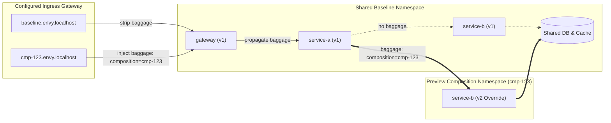

# Envy

> **Preview environments without copying the world.**  
> *Like Git branches, but for running microservices. Test distributed systems on demand by deploying only what you changed.*

[](LICENSE)
[](go.mod)
[](deploy/kubernetes/)
[](docs/mesh-installation.md)
[](cmd/mcp/)

---

Linkerd integration is implemented but **blocked pending current-generation route status from its controller**. See [profile acceptance](docs/mesh-installation.md) before choosing an installation.

## 🎯 What is Envy?

Imagine your application consists of 20 microservices: an API gateway, authentication, billing, search, notifications, caches, databases, and background workers.

You make a two-line bugfix in `service-b`. **How do you test it end-to-end before merging?**

| Traditional Approaches | The Problem |
| :--- | :--- |
| **Shared deployed baseline** | Everyone deploys to the same reference environment. If Alice breaks the shared baseline, Bob's testing is blocked. Deployments collide constantly. |
| **Full Environment Duplication** | Spin up all 20 services, databases, and message queues on every pull request. Takes 15–25 minutes to boot, costs a fortune in cloud bills, and wastes massive compute. |

### The Envy Way: Composable Virtual Environments

Instead of duplicating the world, Envy gives you **ephemeral virtual environments**:

$$\text{Environment} = \text{Deployed Reference Baseline} + \text{Selective Overrides}$$

- You only build and deploy the container you actually modified (e.g. `service-b:v2`).
- Envy allocates an isolated preview URL (e.g. `http://cmp-abc123.envy.localhost:8080`).
- When a request hits your preview URL, the selected mesh steers traffic through the shared baseline services, seamlessly diverting to your new `service-b:v2` override when that service is called.
- Everything else (unmodified services, shared databases, caches) is reused from the baseline!

---

## ✨ Why You'll Love It (The Outcome)

- ⚡ **Instant Previews:** Environments spin up in seconds—because 95% of your architecture is already running live in the deployed reference baseline.
- 💰 **90%+ Cost Reduction:** Run 1 or 2 small override pods per pull request instead of duplicating 20+ heavy services.
- 🔗 **Real Preview URLs:** Share live preview links with teammates, product managers, QA, or automated end-to-end browser tests before merging.
- 🤖 **AI-Agent Ready (MCP):** Comes with a built-in [Model Context Protocol (MCP)](https://modelcontextprotocol.io/) server. External AI agents (Claude Code, Cursor, Codex, GitHub Copilot) can create, inspect, test, and destroy preview environments autonomously.
- 🛡️ **Out-of-band Control Plane:** Envy configures your existing Istio or Cilium mesh. Application traffic stays in that data plane; Envy does not proxy requests.

---

Choose a mesh using the [installation profiles](docs/mesh-installation.md). The chart installs Envy; meshes and ingress remain operator-managed.

## 🔍 How It Works

Envy combines a shared Kubernetes baseline with Istio or Cilium request routing and W3C Baggage propagation:



1. **Ingress Entry:** When a request hits `http://cmp-<id>.envy.localhost:8080`, the configured ingress controller attaches a W3C `baggage: composition=<id>` header.
2. **Context Propagation:** Services pass standard W3C baggage downstream using OpenTelemetry instrumentation (`otelhttp`).
3. **Dynamic Mesh Routing:** Istio VirtualServices or Cilium Gateway API routes match the baggage header. If the header matches your composition ID, the request is directed to your override pod. Unmatched requests transparently route to the shared baseline.
4. **Independent Lifecycle:** When you're done, deleting the composition tears down the isolated namespace and routes; the shared baseline remains untouched.

---

## 🚀 Quickstart: Up and Running in Minutes

For an existing team cluster, use the [Helm installation guide](docs/installation.md).
For API-only testing from another laptop, use the [LAN installation guide](docs/lan-installation.md).
It integrates with operator-managed PostgreSQL, a supported mesh, DNS/TLS, and an identity
proxy. The local options below remain the reproducible evaluation path.

You can explore Envy right now using either the zero-dependency Web UI simulator or the full local Kubernetes stack.

### Option A: Explore the Web UI in Simulation Mode (No Cluster Needed!)

Want to test drive the dashboard without installing Kubernetes or Docker? The frontend includes a built-in simulation mode:

```sh
cd web
pnpm install
pnpm dev
```

Open **`http://localhost:5173`** in your browser. You can click through interactive service topologies, create preview compositions with sample presets, simulate rolling updates, and view real-time diagnostics!

---

### Option B: Full Local Development Stack (`make dev`)

Experience real request routing with a dedicated local [kind](https://kind.sigs.k8s.io/) cluster, Istio service mesh, PostgreSQL, and a 3-service Go microservice demo.

#### 1. Prerequisites

Ensure you have the following installed:
- [Docker](https://docs.docker.com/get-docker/) (must be running)
- [Go 1.27.1+](https://go.dev/dl/)
- `kubectl`
- `python3` and `curl`
- `pnpm` (for the Web UI)

> 💡 **Note:** `make dev` automatically downloads checksum-verified binaries for `kind` (v0.33.0) and `istioctl` (v1.31.0) into `.envy/tools/`. It does not tamper with your global Kubernetes configs or contexts.

#### 2. Start the Local Environment

```sh
make dev
```

This single command:
1. Creates a dedicated `envy-dev` kind cluster with loopback port mappings (`:8080` for ingress, `:8081` for the Envy API).
2. Installs Istio and configures the ingress gateway.
3. Builds and deploys the baseline services: `gateway-v1 → service-a-v1 → service-b-v1`.
4. Starts PostgreSQL and the Envy control plane.
5. Generates local administrative tokens in `.envy/envy-dev/api-token`.

#### 3. Verify the Baseline

Visit or curl the baseline:

```sh
curl http://baseline.envy.localhost:8080/
```

You will see the JSON response showing requests traveling through all baseline v1 services:
```json
{
  "chain": [
    {
      "service": "gateway",
      "version": "v1",
      "composition": "",
      "workload_id": "baseline-gateway",
      "deployment_composition": "baseline"
    },
    {
      "service": "service-a",
      "version": "v1",
      "composition": "",
      "workload_id": "baseline-service-a",
      "deployment_composition": "baseline"
    },
    {
      "service": "service-b",
      "version": "v1",
      "composition": "",
      "workload_id": "baseline-service-b",
      "deployment_composition": "baseline"
    }
  ]
}
```

---

## 🛠️ Step-by-Step Hands-On Example

Let's test a bugfix on `service-b` by deploying `envy/service-b:v2` as an override!

### 1. Set Up Your CLI Environment

Load your generated local API token and target URL:

```sh
export ENVY_API_URL="http://127.0.0.1:8081"
export ENVY_API_TOKEN="$(cat .envy/envy-dev/api-token)"
export ENVY_API_TOKEN_FILE="$PWD/.envy/envy-dev/api-token"
```

### 2. Create a Composition

Create a preview composition overriding only `service-b`:

```sh
# Using the Envy delivery CLI:
# The local demo registers its deployed reference baseline as "staging".
.envy/bin/delivery composition create \
  --project demo \
  --baseline staging \
  --name my-feature \
  --image envy/service-b:v2 \
  --ttl 8h
```

*(Alternatively, via `curl`:)*
```sh
curl -s --fail-with-body http://127.0.0.1:8081/v1/compositions \
  -H "Authorization: Bearer $ENVY_API_TOKEN" \
  -H 'Content-Type: application/json' \
  -H 'Idempotency-Key: demo-service-b-001' \
  --data-binary @examples/create-composition.json
```

The CLI outputs JSON with your new composition ID (e.g. `cmp-4f9e8a1b`).

### 3. Wait for Readiness

Wait until mesh routes converge and health verification succeeds:

```sh
.envy/bin/delivery composition wait cmp-4f9e8a1b --timeout 60s
```

### 4. Test the Preview URL!

Fetch your allocated preview endpoint:

```sh
.envy/bin/delivery composition endpoints cmp-4f9e8a1b
```

Curl your dedicated preview host (e.g., `http://cmp-4f9e8a1b.envy.localhost:8080/`):

```sh
curl http://cmp-4f9e8a1b.envy.localhost:8080/
```

Look at the result:
```json
{
  "chain": [
    {
      "service": "gateway",
      "version": "v1",
      "composition": "cmp-4f9e8a1b",
      "workload_id": "baseline-gateway",
      "deployment_composition": "baseline"
    },
    {
      "service": "service-a",
      "version": "v1",
      "composition": "cmp-4f9e8a1b",
      "workload_id": "baseline-service-a",
      "deployment_composition": "baseline"
    },
    {
      "service": "service-b",
      "version": "v2",
      "composition": "cmp-4f9e8a1b",
      "workload_id": "cmp-4f9e8a1b-service-b",
      "deployment_composition": "cmp-4f9e8a1b"
    }
  ]
}
```

🎉 **Notice that?** `gateway` and `service-a` remained on `v1` (shared baseline), while `service-b` was dynamically routed to `v2`! Meanwhile, other developers calling `baseline.envy.localhost:8080` still see the deployed baseline across the board.

> 💡 **DNS Tip:** If your operating system doesn't automatically route `*.localhost` to `127.0.0.1`, simply add `--resolve '<preview-host>:8080:127.0.0.1'` to your `curl` command.

### 5. Rolling Image Updates

Pushing a new commit? You don't need a new preview URL. Update the running composition in place:

```sh
.envy/bin/delivery composition update cmp-4f9e8a1b \
  --expected-generation 1 \
  --image envy/service-b:v3

.envy/bin/delivery composition wait cmp-4f9e8a1b --timeout 60s
```

The preview URL remains identical, while traffic shifts to `v3` after health checks pass!

### 6. Inspect Logs & Lifecycle Events

```sh
# View logs of your specific override pod:
.envy/bin/delivery composition logs cmp-4f9e8a1b --component service-b --tail-lines 50

# View transactional audit events:
.envy/bin/delivery composition events cmp-4f9e8a1b --limit 10
```

### 7. Clean Up

When your PR is merged or testing is complete:

```sh
.envy/bin/delivery composition destroy cmp-4f9e8a1b
```

---

## 🎛️ Three Ways to Use Envy

Envy provides first-class support for humans, scripts, and AI agents alike:

```text
 ┌─────────────────────────────────────────────────────────────┐
 │                       Access Layers                         │
 ├───────────────────┬─────────────────────┬───────────────────┤
 │  🖥️ Web Dashboard  │  💻 Delivery CLI    │  🤖 AI Agent MCP  │
 │  (React + Vite)   │  (.envy/bin/deliv…) │  (Claude / Cursor)│
 └─────────┬─────────┴──────────┬──────────┴─────────┬─────────┘
           │                    │                    │
           └────────────────► REST API ◄─────────────┘
                                │
                      Envy Control Plane
```

### 1. 🖥️ Web Dashboard (`make ui-dev`)
A sleek dashboard built with React 19, Vite, Tailwind CSS v4, and shadcn/ui.
- Visual service dependency topology and real-time routing status.
- Single-click composition creation wizard with approved image presets.
- Live rolling update status, log viewer, and event timelines.
- Toggleable Live Mode (connected to local/remote API) and Demo Simulation Mode.

```sh
make ui-dev
```

### 2. 💻 Delivery CLI (`delivery`)
A fast, scriptable Go binary for engineers and CI/CD pipelines (GitHub Actions, GitLab CI).
- Easy commands: `create`, `get`, `wait`, `update`, `destroy`, `logs`, `events`.
- Strict JSON output mode for programmatic scripting.
- See [CLI Documentation](docs/cli.md) for complete command options.

### 3. 🤖 AI Coding Agents via Model Context Protocol (MCP)
Envy includes a native stdio MCP server (`.envy/bin/envy-mcp`). Give your coding assistant (Claude Code, Cursor, Copilot Workspace) superpower control over preview environments!

To configure your agent's MCP client, add the server command:
```json
{
  "mcpServers": {
    "envy": {
      "command": "/absolute/path/to/envy/.envy/bin/envy-mcp",
      "env": {
        "ENVY_API_URL": "http://127.0.0.1:8081",
        "ENVY_API_TOKEN_FILE": "/absolute/path/to/envy/.envy/envy-dev/api-token"
      }
    }
  }
}
```

Agents can now automatically run tools like `create_composition`, `wait_for_composition`, `get_component_logs`, and verify their own changes in a live environment!

---

## 👩‍💻 Developer & Contributor Guide

Welcome to the team! Contributing to Envy is straightforward. Follow this guide to set up your local development environment.

### Repository Tour

```text
envy/
├── api/             # OpenAPI 3.0 specification schemas
├── cmd/             # Executable entry points
│   ├── delivery/    # The `delivery` CLI tool
│   ├── mcp/         # The Model Context Protocol (MCP) stdio server
│   └── server/      # The Envy HTTP API & reconciler daemon
├── internal/        # Core business logic
│   ├── domain/      # Pure domain models, entities, and validation rules
│   ├── application/ # Application use cases and command handlers
│   ├── api/         # HTTP handlers and middleware
│   ├── reconciler/  # Desired-vs-observed state reconciliation loop
│   ├── routing/     # VirtualService and routing table compiler
│   ├── providers/   # Kubernetes and mesh adapters
│   └── persistence/ # PostgreSQL schema, migrations, and sqlc queries
├── web/             # Modern React + Vite + Tailwind frontend dashboard
├── deploy/          # Local kind bootstrap scripts & Kubernetes manifests
├── docs/            # Architecture specifications & Architecture Decision Records (ADRs)
└── examples/        # Sample payloads, walkthroughs, and integrations
```

### Common Developer Tasks

All common tasks are wrapped in the root `Makefile`:

```sh
# Start the full development stack (kind + Istio + PostgreSQL + control plane)
make dev

# Run all unit tests
make test

# Run isolated end-to-end acceptance tests in a disposable cluster
make test-e2e

# Start the Web UI dev server with automatic API proxying
make ui-dev

# Build the Web UI production bundle
make ui-build

# Compile Go binaries into .envy/bin/
make build

# Regenerate type-safe Go SQL code after editing SQL queries
make sqlc

# Tear down the local kind development cluster
make dev-down
```

### Architecture Principles to Keep in Mind

When writing code for Envy, we follow these core architectural rules:

1. **Separation of Control Plane and Data Plane:**
   Envy's control plane configures the selected mesh's routing rules and Kubernetes deployments. It **never** proxies or intercepts application traffic directly. If the Envy server restarts or goes down, existing preview environments continue serving traffic without interruption.
2. **PostgreSQL as Single Source of Truth:**
   All desired state, idempotency keys, lifecycle events, and observations are stored in PostgreSQL. Kubernetes resources are derived execution state.
3. **Idempotent Reconciliation:**
   The reconciler periodically checks the state of Kubernetes and the selected mesh, driving the observed state toward the desired state. Network glitches or transient cluster errors heal automatically.
4. **Clean Domain Boundaries:**
   `internal/domain` contains zero Kubernetes or Istio imports. Infrastructure details stay isolated in `internal/providers/`.

---

## 🧩 Advanced Features & Ecosystem

- 🛍️ **Multi-Service Walkthrough:** Follow the [Shop Walkthrough](examples/shop/README.md) to onboard a multi-tier e-commerce application using ordinary business JSON.
- 🌐 **Frontend Previews:** Bind Git commits and frontend previews (like Cloudflare Pages) to live backend compositions. See [Frontend Bindings](docs/frontend-bindings.md) and the [Cloudflare Pages Adapter](integrations/cloudflare-pages/README.md).
- 🔄 **Multiple Overrides:** Override up to three components simultaneously (e.g. `gateway` + `service-b`). See [Multiple Overrides](docs/multiple-overrides.md).
- 🏷️ **Application Catalog:** Learn how projects, approved component profiles, and baselines are registered in [Catalog Documentation](docs/catalog.md).
- 📦 **Git Provenance & Build Pins:** Track exact Git SHAs and image digests from CI. See [Source and Build Setup](docs/source-builds.md) and [GitHub Actions Adapter](integrations/github-actions/README.md).

---

## 📚 Deep-Dive Documentation

- 🏛️ [System Architecture](docs/architecture.md) & [Domain Model](docs/domain-model.md)
- 🔀 [Request Routing Details](docs/routing.md)
- 📡 [REST and MCP API Specifications](docs/api.md) and [OpenAPI Spec](api/openapi.yaml)
- 🩺 [Diagnostics, Logs & Events](docs/diagnostics.md)
- 📜 [Architecture Decision Records (ADRs)](docs/adr/)
- 🔬 [Acceptance Validation & Test Reproductions](docs/validation.md)
- 📋 [Original Product Brief](plan.md)

---

## 📄 License

Envy is open-source software released under the [MIT License](LICENSE).

### Preview an existing deployment

Keep Argo CD or the existing delivery pipeline on main. Envy can derive temporary
overrides from an approved Deployment template and copy its named configuration
dependencies into a composition namespace. See [deployment-derived previews](docs/deployment-derived-previews.md)
for opt-in onboarding and [Argo coexistence](docs/argo-cd-integration.md).
