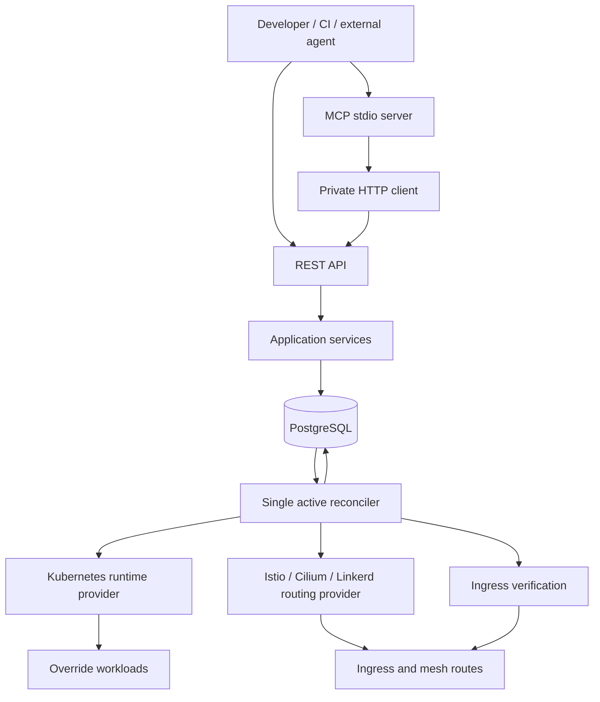

# Architecture

Envy creates temporary compositions of a distributed application. A composition
borrows a registered baseline and deploys selected overrides. External developers,
CI systems, or agents supply prebuilt images and use REST or MCP to create,
inspect, and destroy compositions. The original product brief is retained in
[`plan.md`](../plan.md).

The [next-phase product PRDs](prds/README.md) define proposed onboarding,
dependency, diagnostics, workload, team, reliability and fleet milestones. Their
[shared boundaries](prds/product-boundaries.md) distinguish Envy-owned behaviour,
replaceable bundles and operator-supplied infrastructure. They do not change the
implemented scope below or supersede accepted ADRs without implementation review.

## Implemented scope

The implemented slice targets one trusted organisation and a development
Kubernetes cluster. Its seeded project is `demo`, its baseline is `staging`, and
all three components have approved override profiles. Registered projects can
approve components, and each composition selects zero to three of them; an empty selection inherits the full baseline. The demo composition URL must return the real chain
`gateway-v1 → service-a-v1 → service-b-v2`; ordinary baseline requests must
continue returning `gateway-v1 → service-a-v1 → service-b-v1`.

This is request routing isolation. State, side effects, caches, and inherited
workloads remain shared. Baseline deployments stay live and can change while a
composition exists. Envy does not build images, run coding agents or tests, own
source control, or provide its own mesh or observability storage.

## Control plane and data plane



PostgreSQL is canonical for desired state, observations, idempotency records, and
durable operations. Kubernetes resources are reconciled execution state; Envy
does not introduce CRDs. The API persists intent and its operation before any
provider action. One leader holds a PostgreSQL advisory lock and runs up to four queued
baseline domains concurrently. Kubernetes watches and transactional PostgreSQL
notifications wake work; a 30-second durable-state sweep repairs missed events.
Aggregate route updates remain globally serialized. Database connectivity or lock loss stops provider
mutations. In-memory wakeups may improve latency, but are not a correctness
dependency.

The control plane never proxies application traffic. Existing compositions can
serve while it restarts. Resource names are deterministic and carry installation
and composition ownership. Providers must check ownership before changing or
deleting resources. Database unavailability is not evidence of an orphan.

For the recommended coexistence model with an Argo CD- or Helm-managed
long-lived baseline, see [Argo CD, Helm, Istio, and Envy](argo-cd-integration.md).

## Package boundaries

- `internal/domain`: provider-independent entities, validation, lifecycle, and
  workload/routing contracts.
- `internal/application`, `internal/api`, and `internal/persistence/postgres`:
  commands, HTTP representations, durable transactions and queries. Persistence queries
  and schema definitions are compiled into type-safe Go code using `sqlc` (`make sqlc`).
- `internal/reconciler`: desired/observed state convergence and durable cleanup.
- `internal/routing`: pure compilation of a complete routing-domain snapshot.
- `internal/providers/kubernetes` and `internal/providers/istio`: execution and
  networking integration. Kubernetes types remain in providers.
- `internal/verification`: registered envy-chain routing proof or HTTP reachability
  checks through actual ingress.
- `internal/client` and `internal/mcp`: a private HTTP client and thin MCP adapter.

Use ordinary constructor injection and narrow internal interfaces:

```go
type RuntimeProvider interface {
    Ensure(context.Context, WorkloadSpec) (WorkloadRef, error)
    Observe(context.Context, WorkloadRef) (WorkloadObservation, error)
    Delete(context.Context, WorkloadRef) error
}

type RoutingProvider interface {
    Reconcile(context.Context, RouteSnapshot) (RouteObservation, error)
}
```

`RouteSnapshot` covers an entire baseline routing domain because all compositions
share aggregate mesh routing objects. Its deterministic compilation ends every
logical-service route table with the baseline destination. A single reconciler
prevents lost updates between compositions.

Kubernetes informer caches supply workload observations after synchronization.
Ownership-sensitive mutations use live reads, resource-version checks and
non-forcing Server-Side Apply. Aggregate route reconciliation reloads persisted
intent under one shared lock. Workload image and generation fences prevent stale
cache observations from verifying a previous rollout. See
[kubernetes orchestration](kubernetes-orchestration.md) for queue recovery,
namespace policy migration and field ownership.

Resource-provider and validation interfaces are deferred until a real provider
needs them. Future providers must advertise compatible workload, connectivity,
and routing capabilities before an application plan can be accepted. Bounded
logs will be a separate optional capability, not a universal provider framework.

## Lifecycle

1. Persist a new composition and create operation atomically.
2. Ensure its namespace and quota, then a Service and Deployment for each override
   using its approved profile.
3. Observe every current Deployment generation and ready endpoint.
4. Reconcile aggregate mesh routes, then the exact preview hostname.
5. Probe the real preview and baseline ingress using the registered contract.
   Full chain checks report routing proof; ordinary HTTP checks report only
   reachability, with `RouteVerified` remaining false.
6. Continue observing drift and health. An unhealthy installed override retains
   its explicit route, preventing a false success from baseline fallback.

Transient errors use capped exponential backoff with jitter and remain visible.
Readiness is observed evidence, not an atomic mesh-wide activation guarantee.
Generation and deletion intent are rechecked before status publication.

TTL expiry records the same deletion intent as `DELETE`. Cleanup first removes
the public hostname, observes that it no longer forwards, and drains bounded
in-flight requests. It then removes aggregate route entries and owned workloads.
Destroyed status requires observed absence; a tombstone and operation remain.
Cleanup retries survive restarts.

## Development boundary and roadmap

REST requires a bearer token. Local API and ingress are exposed on loopback.
Development workloads use explicit service accounts, approved configuration,
and resource requests/limits. Opt-in deployment-derived profiles copy only
approved named configuration dependencies; application privileges are not copied. Namespaces aid ownership and deletion; network isolation requires
separately installed and tested policies. Baggage is never authorization.

Milestones 1–5 deliver documentation, the propagated demo, a mandatory manual
routing proof, persistent REST reconciliation, and the initial MCP server with
automated acceptance. The Envy CLI and generation-checked image updates now
extend that slice (see [updates](updates.md)). Bounded log reads and transactional
lifecycle events now support diagnostics through REST and its adapters (see
[diagnostics](diagnostics.md)). Catalog registration and zero to three component overrides are implemented (see
[catalog](catalog.md) and [multiple overrides](multiple-overrides.md)). Resource cloning, Kafka/SQS consumers,
multi-cluster execution, production operation, enforced multi-tenancy, and
billing remain outside this slice. A separately added web frontend calls the REST
API; it shares the same lifecycle and generation rules.

Decisions and revisit conditions are recorded in [`adr/`](adr/).

Catalog registration now validates concrete Kubernetes and selected-mesh connectivity before
persisting immutable entries. Each composition stores a resolved baseline and
approved profiles and per-component workload identities in PostgreSQL runtime state. Reconciliation uses that plan for
workloads, mesh aggregates, exact-host ingress, verification and inherited logs.
One aggregate is generated per registered Service host across all compositions.
The initial demo's aggregate object name is preserved by migration. See
[catalog registration](catalog.md) for supported application contracts.

Portable `envy/v1` configuration bundles support read-only validation and atomic,
repeatable catalog registration through REST and the CLI. See [application
onboarding](onboarding.md) for its supported infrastructure and verification levels.

## Source and artifact resolution

An optional GitHub App integration resolves branches and historical commits in
explicitly registered repositories. Scoped CI reporters register immutable
commit-to-image-digest mappings. Create/update resolves selected build IDs before
persisting workload intent, rechecks registry availability, and stores provenance
in the composition override. The existing reconciler receives digest-pinned
images and approved profiles. See [source builds](source-builds.md).

## Deployment-derived preview profiles

An optional approved profile is scoped to project, baseline and component.
Discovery reads the live Deployment and named dependencies; approval persists a
versioned execution contract. Creation captures the current supported template and
dependency versions in the resolved runtime plan. Kubernetes materializes immutable
copies without persisting Secret payloads in PostgreSQL. Existing compositions
retain captured configuration through image updates and restarts. See
[deployment-derived previews](deployment-derived-previews.md) for onboarding,
permissions, supported settings, version races and acceptance.

## Pub/Sub isolation

Optional [Pub/Sub message isolation](pubsub-isolation.md) adds a dedicated resource
provider reconciled before workloads. The agent selects an immutable
`message_isolation` setting; filtered subscriptions exist independently of consumer
compute. Operators prepare baseline filters, and applications implement attribute
and baggage propagation. Envy observes infrastructure readiness separately from
application correctness. Pub/Sub payloads never pass through the control plane.
