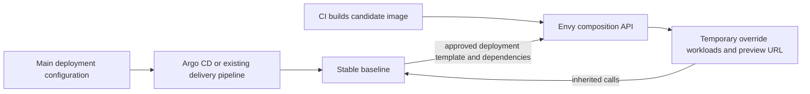

# Argo CD, Helm and Envy

Keep the existing delivery system responsible for the long-lived baseline.
Argo CD follows main; CI builds immutable candidate images; a developer, agent,
or test job asks Envy to run selected images beside that baseline.

Envy owns its PostgreSQL intent, composition namespaces, derived Deployments,
Services, approved ConfigMap/Secret copies, and generated Istio routes. The
platform owns the shared Gateway, ingress, DNS and TLS. Baseline ingress routes
and workloads remain owned by their existing delivery tool. The Envy control
plane is installed separately.

## Start with the deployed application

Follow [deployment-derived onboarding](deployment-derived-previews.md) to discover
an existing Deployment, review its dependencies and approve a scoped preview
profile. Callers need neither Kubernetes access nor Helm rendering. Existing
`http-small` profiles remain supported while teams opt in component by component.

A profile does not authorize arbitrary charts, application identity or volumes.
Discovery reports unsupported settings and the specific source-read permissions
needed. Envy copies only approved named dependencies into its own namespace.
Dependency addresses must remain meaningful there; configure approved replacements
where necessary and test application context propagation.

## Keep the baseline on main

For branch testing, build the image and create a composition. Do not repoint the
baseline Application's revision or change its Helm image values to the branch.
After merge, the ordinary delivery pipeline promotes main as before.

An active preview retains its override template and copied configuration, while
inherited services follow the live baseline. A new preview adopts current
configuration within its approved contract. A changed contract needs discovery
and approval again. A baseline binding revision is not an Argo Git revision and
does not freeze inherited images, configuration or shared data.

## Argo ownership

The [example Applications and AppProjects](../integrations/argocd/README.md) separate
platform, baseline and Envy installation ownership. Do not template or attach
Argo tracking annotations to Envy-created resources. Argo resource tracking, not
merely namespace membership, determines which resources belong to an Application.
`FailOnSharedResource=true` detects conflicts between Argo Applications; Envy's
own ownership checks protect its resources separately.

Never give two controllers the same desired Kubernetes object. Envy's aggregate
mesh routes must not overlap existing application-managed routes for the same
Service host. Catalog validation checks routing compatibility. Keep the registered
Service identities stable; migrate the baseline contract deliberately when names,
ports, Gateway listeners or mesh configuration change.

## Pipeline integration

Use the [GitHub Actions examples](../integrations/github-actions/README.md) for:

- Disposable tests: build/report, verify baseline health, create, wait for the
  accepted generation, test the preview URL, and destroy.
- Retained previews: an explicit request creates or updates a selected composition
  and leaves it until TTL expiry. Store its ID and coordinate all subsequent
  updates; a human or agent may be using that URL.

CI health checks must query the real deployment system and baseline ingress.
Argo being healthy does not prove preview routing or application behavior. Envy
readiness is generation-specific; application tests remain caller-owned.

Existing Secret copies do not follow rotations. Recreate previews when new
credentials or configuration are required. Destruction withdraws preview routes
and deletes only owned resources. It never rolls back or uninstalls the baseline.

This integration does not replace continuous delivery, provide full environment
snapshots, or make arbitrary Helm charts preview-compatible.
