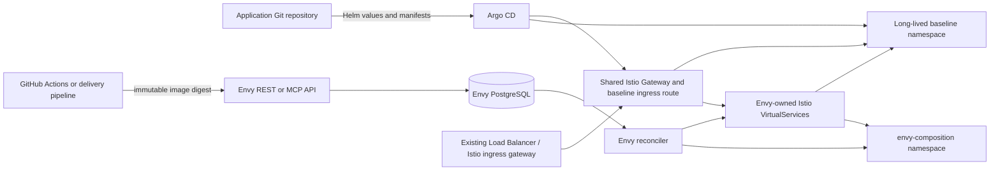

# Argo CD, Helm, Istio, and Envy

Envy is designed to sit beside the deployment system that owns a long-lived
staging or pre-production environment. Argo CD, Helm, GitHub Actions, or
another delivery tool can keep the baseline application converged. Envy then
adds short-lived composition workloads and routing for a selected immutable
image without copying or taking ownership of the baseline.

The recommended boundary is:

- **Argo CD/Helm owns the baseline.** This includes the baseline Deployments,
  Services, ConfigMaps, application Secrets, the Istio `Gateway`, the baseline
  ingress `VirtualService`, and the long-lived namespace.
- **Envy owns compositions.** This includes composition namespaces, their
  approved override Deployments and Services, per-composition preview
  `VirtualService` objects, and aggregate mesh `VirtualService` objects.
- **The ingress gateway and external load balancer remain shared.** Envy
  attaches to the existing Istio `Gateway`; it does not create a load balancer,
  change DNS, replace the Gateway, or proxy application traffic.

Envy's REST API and PostgreSQL remain the source of truth for composition
intent. The current implementation does not use an Envy CRD and does not ask
Argo CD to reconcile ephemeral composition state.

## Target topology



The load balancer only needs to expose the Istio ingress gateway. Envy's
preview route uses the same Gateway and therefore follows the same TLS
termination, listener, network policy, and external load-balancer path as the
baseline.

## Ownership matrix

| Resource | Baseline delivery tool | Envy | Coordination rule |
| --- | --- | --- | --- |
| Long-lived application namespace | Owns | Reads during catalog validation | Keep the namespace and Service identities stable |
| Baseline Deployments and Services | Owns | Reads | Envy never adopts or updates them |
| Baseline ConfigMaps and application Secrets | Owns | Does not copy them | Composition profiles accept only approved literal environment and pull-secret references |
| Istio `Gateway` and listener/TLS configuration | Owns | Reads | Gateway must select the configured ingress gateway and cover baseline plus preview hosts |
| Baseline ingress `VirtualService` | Owns | Reads and validates | It must remove incoming `baggage` and route the baseline host directly to the baseline entry Service |
| Envy control-plane Helm release | Operator/Argo CD | Runs the control plane | Install separately from the application baseline |
| Composition Namespace, `ResourceQuota`, ServiceAccount | None | Owns | Envy labels and ownership annotations protect mutations and deletion |
| Composition override Deployment and Service | None | Owns | Envy creates only the approved profile; it does not render an application Helm chart |
| Aggregate mesh `VirtualService` | None | Owns | One aggregate per baseline Service host; baseline is always the final fallback |
| Preview ingress `VirtualService` | None | Owns | One exact preview host per composition, attached to the existing Gateway |
| PostgreSQL state | Operator-managed | Reads/writes its own schema | PostgreSQL stores composition intent, observations, operations, and ownership tokens |

The ownership labels and annotations are part of the safety boundary:

```text
envy.dev/installation
envy.dev/composition
envy.dev/component
envy.dev/route-role
envy.dev/ownership-token
```

Envy checks its installation label and persisted ownership token before updating
or deleting an Envy-generated `VirtualService` or workload. A conflicting
baseline route or Gateway configuration causes catalog validation or
reconciliation to fail rather than being adopted.

## Baseline contract

Argo CD can use any Helm chart or manifest layout for the baseline, but Envy
needs a stable integration contract:

1. Each registered component has a stable Service FQDN and port, such as
   `pricing.shop-staging.svc.cluster.local:8080`.
2. The baseline namespace has an existing Istio `Gateway`. Its selector must
   match Envy's configured `istio.ingressSelector`.
3. The Gateway listener covers the exact baseline hostname and the generated
   composition hostname domain. For HTTPS, it must terminate TLS with a
   certificate covering both.
4. The baseline ingress route is one exact-host, unconditional route that
   removes `baggage` and sends traffic to the registered entry Service.
5. Baseline workloads and composition workloads use compatible Istio sidecar
   injection labels. Envy applies the configured `istio.injectionLabels` to
   composition namespaces.
6. Any private composition image pull Secret is distributed by an
   operator-managed mechanism, Kyverno, or another approved controller. Envy
   only references approved Secret names; it does not copy registry credentials.

Catalog registration is the boundary check for this contract. It reads the
Gateway, Services, sidecars, existing ingress route, host coverage, and
baseline connectivity before persisting the project and baseline. It never
changes the baseline. Registering a baseline successfully means Envy can
reason about the existing deployment; it does not make Envy the owner of that
deployment.

## Lifecycle with Argo CD

### 1. Argo synchronizes the baseline

Argo CD applies the long-lived application Helm release, including the
baseline workloads, Services, Gateway, and baseline ingress route. The
baseline must be ready before Envy catalog registration or composition
creation.

The Envy control plane is a separate Helm release. Its chart installs the
control-plane Deployment, Service, ServiceAccount, RBAC, configuration, and
network policy. It does not install PostgreSQL, the application baseline,
Istio, DNS, or TLS.

### 2. The operator registers the existing deployment

The operator supplies a versioned catalog manifest containing:

- project and baseline identifiers;
- component profiles and health paths;
- baseline Service FQDNs and ports;
- the baseline entry component;
- the existing Gateway and namespace;
- the public baseline hostname and preview domain;
- the verification contract.

Run `delivery catalog validate` as a read-only check, then
`delivery catalog apply` after the Argo application is healthy. The catalog
stores a baseline revision and immutable bindings. A new Argo deployment does
not silently rewrite those bindings.

### 3. CI publishes an immutable candidate

GitHub Actions or another build system builds the candidate image, records its
commit-to-digest provenance, and reports the build using the scoped build
credential. Envy receives an OCI digest, not a mutable tag. The build system
does not need Kubernetes write access to the baseline.

### 4. CI asks Envy for a composition

The pipeline calls the Envy REST API, delivery CLI, or MCP server with the
project, baseline, expected baseline revision, composition name, and selected
image digests. Envy persists the request and returns a composition identity
before Kubernetes reconciliation finishes.

```text
Argo baseline sync
        |
        v
catalog validate/apply -----> stable baseline contract
        |
immutable image build/report
        |
        v
Envy composition create/update
        |
        v
Envy waits for override workloads and routes
        |
        v
application tests use the preview URL
        |
        v
Envy composition destroy
```

Envy creates one namespace per composition, then creates the approved
Deployment and Service for each override. It observes rollout readiness and
ready EndpointSlices before publishing the composition as ready. A failed
override never silently falls back to the baseline for that component.

### 5. Envy publishes Istio routes

Envy reconciles a complete routing snapshot for all active compositions. This
is important because every composition shares aggregate mesh route objects.
The single active reconciler uses PostgreSQL state and a leadership lock so
two composition updates cannot overwrite each other's route entries.

For an overridden component, Envy writes an aggregate mesh
`VirtualService` in the baseline routing namespace:

```text
host: <component>.<baseline-namespace>.svc.cluster.local
gateway: mesh

match baggage containing composition=<id>
  -> <component>.envy-<id>.svc.cluster.local

otherwise
  -> <component>.<baseline-namespace>.svc.cluster.local
```

For the public preview, Envy writes an exact-host `VirtualService` such as
`cmp-<id>.<preview-domain>` to the existing Gateway. That route sets
`baggage: composition=<id>` before sending the request to the baseline entry
Service or its composition override when the entry component is overridden.
Downstream service-to-service calls retain the baggage context, so only the
selected components divert to the composition.

The external load balancer is not aware of composition IDs. It continues to
send traffic to the same Istio ingress gateway; Istio selects the exact-host
preview route and Envy's aggregate mesh routes select the override at each
downstream hop.

### 6. Baseline and composition updates remain separate

An Envy composition update changes only its desired override map and generation.
It preserves the composition ID, preview hostname, and component identities
while rolling the selected override workloads. Argo CD does not need to sync
the composition namespace.

An Argo baseline update can change application images without changing Service
identity. Existing compositions retain their resolved baseline plan and
continue using their selected overrides. New composition requests should send
the current expected baseline revision; a stale revision is rejected so a
pipeline cannot accidentally test against an unknown baseline.

If an Argo change alters Service names or ports, Gateway hosts, the entry
component, sidecar injection revision, or the routing contract, treat it as a
catalog migration:

1. deploy and validate the new baseline;
2. register the new immutable baseline identity or revision according to the
   catalog policy;
3. move new preview pipelines to that baseline;
4. drain or deliberately recreate compositions tied to the old contract.

Do not change the meaning of an existing baseline ID underneath active
compositions.

### 7. Cleanup

When tests finish, CI calls `DELETE` or waits for the TTL. Envy first withdraws
the public preview route, then removes mesh entries after bounded drain
observation, and finally deletes the owned composition namespace. The baseline
namespace, Services, Gateway, load balancer, and PostgreSQL remain untouched.

## Argo CD coordination

Use separate Argo Applications or ApplicationSets for:

1. platform infrastructure and the shared Istio ingress;
2. the long-lived application baseline;
3. the Envy control-plane Helm release.

Copyable placeholder `AppProject` and `Application` manifests, including
least-privilege destinations and resource allowlists, are in the
[Argo CD ownership examples](../integrations/argocd/README.md). The examples
make the existing Gateway boundary concrete: the platform application owns
the shared `Gateway`, the baseline application owns the baseline ingress
`VirtualService`, and Envy owns only its generated composition resources.

The baseline Application should not render Envy composition namespaces,
composition Deployments, or Envy-generated `VirtualService` objects. Avoid a
single broad chart that templates both the baseline route and an Envy route
with the same name or host.

If an Argo Application uses broad resource discovery or pruning, explicitly
exclude Envy-managed resources by namespace, kind, or the `envy.dev/*` labels.
Do not rely on Argo to preserve an object that its desired manifests claim to
own. Conversely, do not add Argo tracking annotations or a Git-managed desired
manifest to Envy-generated objects: Envy must remain the sole writer for its
composition resources.

Useful coordination rules are:

- Run catalog validation after an Argo baseline sync, not before the baseline
  Services and Gateway exist.
- Gate a preview pipeline on the Argo application being healthy.
- Use Argo sync waves or a post-sync notification only to trigger an external
  catalog check or pipeline; do not make an Argo hook continuously reconcile
  composition state.
- Keep the Envy API token and registry credentials in CI/secret-manager
  storage, never in Helm values or Git.
- If Argo changes the Gateway listener or host set, make catalog validation a
  required deployment check before accepting new compositions.
- Prefer Argo's shared-resource conflict detection for the baseline
  Application, and make any intentional cross-Application ownership explicit.

Argo CD remains responsible for desired state declared in Git. Envy remains
responsible for durable, expiring runtime intent that is created by a user,
agent, or test pipeline. This separation prevents an expired preview from
becoming a stale Git commit and prevents a Git sync from deleting a live
preview unexpectedly.

## GitHub Actions integration pattern

A minimal pull-request workflow is:

1. Build and test the changed component.
2. Report the immutable image digest to Envy.
3. Discover the current project and baseline.
4. Create or update a composition with the expected baseline revision.
5. Wait for Envy workload and route readiness.
6. Run application tests against the returned preview URL.
7. Publish the test result and preview URL to the pull request.
8. Destroy the composition, or retain it with a bounded TTL when a human needs
   to inspect it.

Argo CD may still deploy the branch or commit to the shared staging baseline
through its normal GitOps workflow. That is a different operation from an
Envy composition: staging changes the long-lived baseline; Envy diverts only
the selected service calls for the preview host and composition baggage.

For a team that wants GitOps-style composition requests, use a small adapter
that watches a separate preview request repository or pull-request event and
calls Envy's API. The adapter should store the Envy composition ID and desired
generation as status, use idempotency keys, and treat Envy as the lifecycle
authority. It should not generate a second Helm release for every composition.

## Security and RBAC

The Envy control-plane ServiceAccount needs Kubernetes access to composition
workload resources and Istio `VirtualService` objects. It needs read-only
access to Gateways for validation; it does not need to modify the shared
Gateway. Envy's resource provider checks ownership before every mutation and
deletion.

The baseline deployment controller and Envy should use separate ServiceAccounts
and narrowly scoped RBAC. A registry-secret synchronization controller may
distribute approved pull Secrets into composition namespaces. Envy only adds
approved Secret references to its generated Pods and does not read or copy
application credentials.

Traffic routing is not authorization. The `baggage` value selects a route
inside the mesh; it must not be treated as proof that a caller is allowed to
use a composition. The public API, preview ingress, identity proxy, and
application authorization remain separate concerns.

## Failure and drift behavior

- If Envy restarts, PostgreSQL intent and existing Istio resources remain; the
  reconciler resumes from durable state.
- If an Envy-owned `VirtualService` is deleted, the next reconciliation
  rebuilds it from the complete snapshot.
- If an unowned route overlaps the registered baseline or preview domain,
  catalog validation or reconciliation fails rather than adopting it.
- If Argo overwrites or prunes an Envy-owned route, Envy and Argo will fight;
  fix the ownership boundary instead of adding retries.
- If the baseline becomes unhealthy, existing composition routes are not
  automatically changed to a different baseline. Stop new composition creation,
  repair or migrate the Argo release, and decide how to handle active previews.
- If a composition workload fails, Envy reports the failure and keeps the
  explicit route semantics visible; it does not silently serve staging and
  report success.

## Deliberate non-goals

This integration does not make Envy:

- an Argo CD replacement or a Helm renderer for application charts;
- an ingress controller, external DNS controller, or load-balancer manager;
- an owner of the long-lived baseline namespace or its application Secrets;
- a CRD-based GitOps state machine in the current implementation;
- a builder, test runner, or source-control workflow engine.

Those responsibilities can be added through adapters and CI integrations while
keeping Envy's core contract: immutable selected workloads, shared Istio
routing, durable composition lifecycle, and explicit ownership.

See [installation](installation.md), [catalog registration](catalog.md),
[image updates](updates.md), [source builds](source-builds.md), and
[operations](operations.md) for the underlying contracts.
