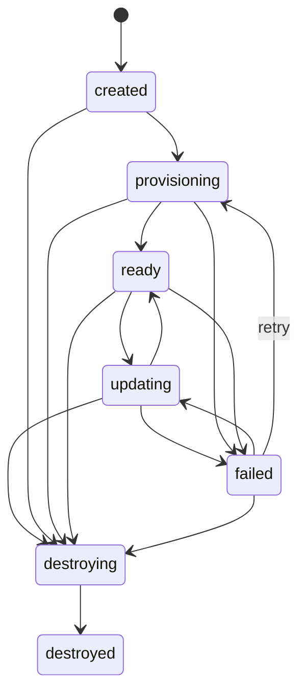

# Domain model

| Concept | Meaning |
| --- | --- |
| Project | Scope for components, resources, baselines, and compositions. |
| Component | Logical workload with protocol, port, health configuration, optional source provenance, and an approved deployment profile. |
| Resource | Logical stateful dependency and its supported provider strategies. |
| Baseline | Versioned registration of logical components and resources to existing deployments/endpoints. Borrowed workloads are never owned by a composition. |
| Composition | A baseline reference plus desired overrides, expiry, generation, observed state, and endpoints. |
| Component override | Prebuilt image deployed with its component's approved profile. |
| Resource override | Requested provider strategy and source. Only inheritance is supported in this slice. |
| Operation | Durable status of an accepted create, update, or destroy command. |
| Route context | Globally unique composition ID carried in W3C baggage. It selects routing and grants no access. |

All baseline and component resolution is project scoped. A composition can
reference independently built images from multiple repositories in the eventual
model; there is no environment-wide branch identity. This first slice accepts
exactly one override, for `demo/service-b`.

## Desired and observed state

Desired fields include `id`, `project`, `baseline`, `baseline_revision`, `name`,
`overrides`, `generation`, `expires_at`, and durable deletion intent. The revision
pins the registered bindings, not the workloads behind them. Inherited images
can change while a composition exists.

Observed fields include `observed_generation`, `phase`, component observations,
conditions, endpoints, owned-resource identities, `latest_operation`, and
`last_error`. Component observations identify inheritance or override, image,
status, and workload identity where available. The API exposes a public endpoint
as `{ "url": "...", "ready": false }` until request verification succeeds.

Conditions distinguish `WorkloadsReady`, `RoutesConfigured`, and
`RouteVerified`. A ready Deployment is insufficient evidence that
distributed proxies have received the intended routes.

`failed` records a diagnostic failure; recoverable work continues to reconcile.
Cleanup failures remain `destroying` with a visible error and retry. The
destroyed tombstone is retained. Image updates require an expected generation and preserve endpoint identity.
Updates are accepted from ready or failed before expiry, enter `updating`, and
return to ready only after the current generation passes ingress verification.

Create, update, and destroy operations contain `id`, `kind`, `status`, and optional
structured `error`. The latest operation travels with a composition. An operation
is accepted durably before provider work begins and completes only when its
target lifecycle condition has been observed.

## Validation and limits

- Only seeded project `demo`, baseline `staging`, and component `service-b` are
  accepted for composition creation.
- Exactly one image override is required. Unsupported component/resource
  strategies fail before provider mutation.
- TTL is a positive Go duration string, defaults to `8h`, and cannot exceed the
  configurable maximum (default `24h`).
- The default live-composition cap is twenty; destroying compositions count
  until cleanup has completed.
- An optional idempotency key supports safe retries. The same key and logical
  request return the original composition; different content returns conflict.

## Resource semantics

Shared baseline databases, caches, queues, credentials, and side effects remain
shared. An inherited process with a startup-configured connection pool cannot
be redirected merely by changing a composition's resource binding. Future
resource overrides must deploy the consuming component with new bindings or
require supported application-level resource selection.

Async propagation is not worker selection. Kafka consumer groups, Pub/Sub
subscriptions, and SQS queues have different delivery semantics. A future
provider must manage destinations and consumer selection together; copying a
composition identifier into a message is insufficient.
