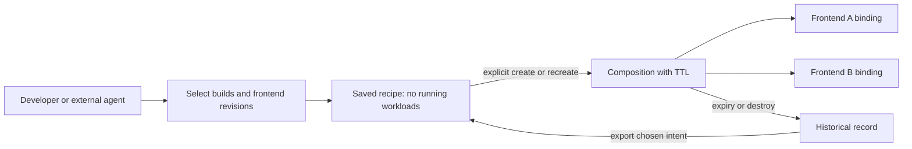

# Agent-driven environment workflows

Status: proposal for discussion. This document describes caller workflows and
recommended next work; it does not introduce implemented APIs or change lifecycle
semantics. The implementation references below were checked on 2026-09-11.

Implementation follow-up: the demand-driven agent kit and initial portable
[recipe helpers](recipes.md) now implement the first two steps below. Recipes
use existing REST operations rather than a new stored entity; the create API
adds a binding-revision guard. Baseline-backed frontend targets and component
membership updates remain proposed work.

## Recommendation

Create compute when a developer or agent needs a running integration environment.
Treat a PR as optional source context, not as the owner of a composition. Let the
caller choose which component builds and frontend revisions to combine. Offer
automation for selected ongoing work only after that choice is explicit.

Separate four actions: build an artifact, select a combination, run it, and verify
it. A successful build does not require a deployment. Saving a combination does
not require keeping it running. A ready endpoint does not prove application tests
passed. This preserves Envy's boundary: callers own agents, CI, frontend hosting
and tests; Envy owns composition execution and its lifecycle.

Start with better composition commands and a portable saved recipe. Defer a
new server-side task/workspace entity until we have a concrete need for shared
ownership, concurrent editing or durable named pointers across callers.

## Alternatives

| Approach | Creation trigger | Subsequent changes | Best fit and cost |
| --- | --- | --- | --- |
| Every PR | Open/update event | Follow PR builds automatically | Consistent review URLs, but many unused workloads; documentation changes may need none. |
| Explicit PR request | Label, button or command | Manual or opted-in build following | A useful convenience for single-repository work; cross-repository combinations still need an explicit selection. |
| Agent/developer request | Integration testing or manual exploration needs an endpoint | Caller chooses each build and composition | Matches exploratory work and controls compute; needs discover/reuse/save/recreate tooling. |
| Hybrid | Explicit creation | Follow explicitly selected sources until expiry or cancellation | Useful later for active review; requires policy for updates, failures, ownership and stopping. |

Recommended default: agent/developer request. An explicit PR trigger could invoke
the same workflow later. Automatic updates are a separate opt-in, not an implied
consequence of creating a composition.

Path filters can reduce unnecessary CI builds, but they belong to the application's
CI policy. A README-only change normally needs neither a new image nor an
environment; an executable documentation example may still need testing. The
agent uses the task and repository test requirements rather than a universal
filename rule. Nothing in Envy should force CI to run on every PR.

## Journey 1: a short agent task

Example request: “Change the pricing calculation and verify it through the shop.”

1. Discover the project, baseline, approved components and relevant published
   builds. Run the appropriate local checks first. If those satisfy the task,
   stop without creating an environment.
2. If integration testing needs an endpoint, inspect a composition explicitly
   associated with this task. Reuse it only when its project, baseline, complete
   override set, readiness and remaining lifetime fit. A similar name is not
   enough, and another person's preview must not be silently repurposed.
3. Ask external CI to build if the required artifact does not exist, or explain
   the missing build. Once a build exists, resolve its exact ID/digest. Do not
   substitute an older successful build for the requested revision.
4. Create a pricing override over the baseline using an idempotency key, or
   update the task's compatible composition using its expected generation.
   Creation is covered by the user's request to perform the integration task;
   repeated routine approval is unnecessary within that scope.
5. Wait for current readiness, perform the actual application checks, and return
   the selected source/builds, endpoint, evidence and expiry. Attach a frontend
   only if the task needs one.
6. Destroy a disposable test environment when finished. If the user wants to
   inspect it, leave it until its stated expiry or explicit cleanup.

Resource outcome: zero composition workloads for a task that needs no environment;
otherwise only the requested overrides run. The existing baseline and Envy control
plane still consume their normal resources.

## Journey 2: an evolving task across repositories

Example: start with pricing, then change checkout tomorrow, while retaining the
pricing fix. There is no requirement that the repository branches have the same
name or share a PR.

The agent first states the complete intended combination: pricing build P2,
checkout build C3, other components inherited. It compares this with the current
composition and explains which changes affect existing users of its URL.

| Change | Current behavior | Recommended caller behavior |
| --- | --- | --- |
| Pricing P1 → P2, same overridden components | Supported image/build update | Keep composition and endpoint; submit the complete override set with expected generation; reverify. |
| Add checkout while retaining pricing | Component membership changes are rejected | Create a replacement composition with both builds and a new URL. |
| Return pricing to inheritance, retaining checkout | Component membership changes are rejected | Create a replacement with only checkout overridden. |
| Compare two alternatives simultaneously | Separate compositions supported | Fork the desired combination into a second composition explicitly; account for both against capacity. |
| Switch baseline or project | No such update operation | Create a new composition after catalog validation. |

For a replacement, keep the old composition until the replacement passes checks
and callers switch, then destroy the old one if no longer needed. This temporarily
uses capacity for both. If there is no capacity, the caller must choose whether
to stop the old environment first and accept an interruption; do not silently
evict another preview.

Desired future behavior: adding or removing overrides can keep a composition's
identity. That needs explicit reconciliation and cleanup work, including retiring
removed routes, observing absence and invalidating generation-specific evidence.
It is not merely a CLI flag. The current limit is one to three overrides; a move
to zero would require a deliberate baseline-only composition decision.

One coordinator owns the combined update for a task. If another actor changes its
generation, refetch and review the difference instead of blindly retrying a stale
complete override set. An agent switching services must not drop earlier work.

## Journey 3: switch or compare frontends

Example: try a mobile-oriented storefront against the pricing preview, then return
to the original web frontend without changing backend services.

1. Select the existing composition explicitly and verify it is still usable.
2. Select the frontend repository and exact committed revision independently of
   backend source. Different frontend repositories use distinct frontend names.
3. Bind the revision, resolve its API URL, then build/deploy through the external
   frontend tools. The local shop helper serves one frontend on port 4174;
   multiple simultaneous sites need separate hosting/ports and application CORS
   configuration. Backend credentials never belong in the browser bundle.
4. Record the frontend URL and report checks actually performed. Keep or stop the
   previous frontend independently; Envy does not own its hosting resources.

Multiple frontends can target the same composition without additional backend
override workloads. However, they observe subsequent updates to that composition;
independent backend comparisons require separate compositions. Browser evidence
becomes stale when the backend generation changes.

Today `(project, frontend name, revision)` binds immutably to a composition and
repository. The same frontend revision cannot be rebound under that same key to
a replacement composition. The local helper solves this by including the
composition ID in the frontend name. A reusable caller helper should hide this
naming detail while preserving the actual immutable binding and its evidence.
An explicit binding identity can be considered later if this becomes awkward in
the product; do not silently retarget existing receipts.

If only the frontend changes and baseline APIs suffice, build directly against
the baseline endpoint. Today that path is outside composition frontend bindings:
creation requires an override and a binding requires a composition. Do not deploy
a redundant backend merely to satisfy those models. Supporting baseline targets
in frontend resolution is a separate, useful capability to consider.

## Journey 4: resume the next day

Example: “Continue the checkout work with the frontend I used yesterday.”

The agent retrieves saved intent rather than assuming yesterday's hostname still
works. That intent identifies a project/baseline, exact override builds and the
frontend repositories/revisions. A prior composition ID is a reference to inspect,
not a promise that resources remain available.

- **Still live and suitable:** inspect generation, desired overrides, readiness
  and expiry; reuse explicitly and rerun checks as needed. Updates do not renew
  TTL. If too little lifetime remains, recreate rather than assuming an extension.
- **Expired or destroyed:** create a new composition from saved intent after
  validating current catalog compatibility, artifact availability and capacity.
  Allocate a new hostname and new frontend bindings; rebuild frontends that embed
  the old API URL. The old tombstone and evidence remain historical.
- **Build unavailable or repository disabled:** return a precise missing input.
  The caller can restore/rebuild artifacts externally or deliberately select a
  newer build. Rebuilding the same source need not produce the same digest.
- **Baseline changed:** report the live inheritance semantics. Exact override
  builds do not freeze inherited deployments, shared data or credentials.

Existing defaults are eight-hour TTL, configurable maximum twenty-four hours and
a live-composition cap of twenty. There is no TTL renewal or suspend/resume API.
Persisting desired intent lets compute expire; it does not preserve databases,
in-flight work, logs forever or frontend hosting. Automatic revival on a URL visit
would be a new product behavior and is not proposed here.

## What should be saved?

| Option | Benefits | Drawbacks | Recommendation |
| --- | --- | --- | --- |
| Composition ID / tombstone alone | Already durable; records builds and history | Recreate requires selecting desired inputs from observations; frontend selection may be ambiguous | Use as the source for an export helper. |
| Portable recipe | Persists a selected combination without live resources; usable by different agents | Caller must store/share it and handle missing artifacts | First addition: versioned JSON plus validation and export/recreate helpers. |
| Server-side task workspace | Can hold a shared name, active composition pointer and collaborators | Adds ownership, concurrent edits, retention and pointer semantics | Defer until recipe workflows demonstrate a need. |

A proposed recipe records a schema version, project and baseline references,
observed baseline binding revision for comparison, component-to-build IDs (or
explicit immutable image references), independent frontend repository/name/SHA
selections, and a requested lifetime. It may retain the previous composition ID
for discovery. Do not export tokens, Kubernetes objects, resource identities,
observed readiness, public URLs as durable endpoints, or generation numbers as
valid expectations for a newly created composition.

Build IDs are installation-local. Include source and digest information as
diagnostics, not as authority to bypass build validation in another installation.
Recipe import into another installation requires separately registered catalogs
and build provenance. If the baseline binding revision differs on recreation,
surface the difference and require an explicit caller choice to use the current
binding. Changes behind unchanged live bindings still cannot be frozen.

This is a proposal for an intent file, not a new provider framework or a second
canonical database. PostgreSQL remains canonical for every running composition.

## Agent policy and optional automation

The agent should choose among no environment, baseline-only use, reuse, update,
replacement and a parallel comparison. Its response should say what will run,
what stays inherited, which existing URL changes, and when resources expire.
Use a lifetime appropriate to the task; the default is a fallback, not a reason
to keep short tests running all day. Inspect readiness and desired intent before
reuse. Apply the same rules from CLI, MCP and UI; no agent runtime belongs inside
Envy.

Automatic build following could later be attached to an explicitly selected
component/repository/ref and composition. It must resolve each change to an exact
successful build, preserve all other selections, respect generation conflicts and
capacity, and stop at expiry or destruction. A failed build should be reported
while the previous build remains clearly identified; it must not be presented as
the requested revision. Readiness regressions must be visible.

PR closure should trigger cleanup only for compositions explicitly declared to
belong to that PR. A cross-repository agent task may outlive one of its PRs. Polling
itself is not the main compute cost; unnecessary workloads and CI builds are.
Path filters and inactivity heuristics cannot replace explicit ownership and TTL.

## Proposed implementation order

1. Update the agent workflow kit to select whether an environment is needed and
   discover/reuse exact build-backed compositions. Include replacement semantics,
   frontend selection and expiry handling. Keep these instructions provider-neutral.
2. Add versioned recipe validation/export and recreate through the existing
   authoritative create path. Provide CLI/MCP parity; keep endpoints and evidence
   tied to actual compositions. Existing tombstones remain usable input.
3. Make frontend binding identity convenient across recreation and expose a clear
   stale/expired state to callers. Consider baseline-backed frontend targets
   separately; creating dummy overrides is not the solution.
4. Support adding/removing overrides in an existing composition, with provider
   cleanup and generation/evidence tests. Until then, use replacement compositions.
5. Add optional source-following or explicit PR triggers only when these journeys
   work well. Do not enable every-PR compute by default.

Acceptance examples for those additions:

- A documentation-only task makes no create call; an integration task requests
  only needed overrides and reports its actual verification level.
- An agent retry reuses its saved composition; another task's environment is not
  silently selected or mutated.
- Switching frontend revisions leaves backend deployments unchanged, and two
  frontend bindings can resolve to the same ready composition.
- Recreating an expired saved selection allocates a new ID/URL, creates valid new
  frontend bindings and does not reuse old passing evidence.
- Missing artifacts and catalog changes produce actionable results with no
  silent revision substitution; unchanged live bindings still inherit staging.
- A concurrent generation change prevents overwrite; changing component membership
  is either explicitly rejected with replacement guidance or fully reconciled.
- Cleanup removes only the owned runtime. Saved recipes, historical evidence and
  unrelated compositions remain available.

## Implementation references

- [Current composition model and limits](domain-model.md)
- [Update membership validation](../internal/application/service.go)
- [Current frontend binding semantics](frontend-bindings.md)
- [GitHub revisions and build provenance](source-builds.md)
- [Existing agent kit](agent-workflow.md)
- [Local operator workflow and live checks](../integrations/local-preview/README.md)

Open design choices before implementation: how recipes are shared between
callers, how a friendly task label maps to a saved selection, and whether demand
for baseline-backed frontends warrants prioritizing that before membership
updates. None requires committing now to a server-side workspace or PR controller.
