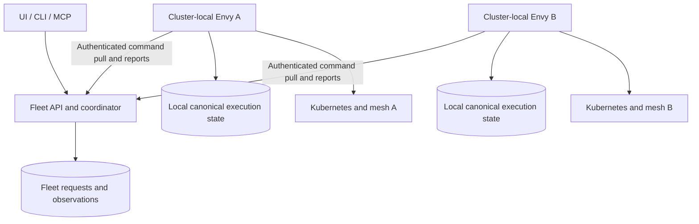

# PRD 07: Multi-cluster fleet management

Status: proposed. Priority: design target scoping early; implement after team and
reliability gates. Contract: [Shared boundaries](product-boundaries.md).
Evidence baseline: [reviewed commit](README.md#evidence-baseline).

## Problem, users and current state

A platform owner may operate several Kubernetes clusters across Google Cloud
projects and administrative accounts. Developers need one place to select an
approved target, create a preview and inspect it without handling cluster credentials.

Implemented evidence:

- [Server provider construction](../../cmd/server/main.go) creates one Kubernetes
  client/configuration and selected mesh provider set for an installation.
- [Installation binding](../../internal/persistence/postgres/installation.go),
  [its tests](../../internal/persistence/postgres/installation_test.go) and
  [singleton schema](../../internal/persistence/postgres/migrations/010_mesh_installation.sql)
  bind one installation/mesh profile to its metadata database.
- [Lease implementation](../../internal/persistence/postgres/lease.go) and
  [local queue](../../internal/reconciler/queue.go) supply cluster-local authority
  and recovery. They are not a fleet scheduler.

Separate installations can be operated independently today. A multi-context
kubeconfig does not make the current server a multi-cluster controller.

## First milestone and architecture

M1 adds a fleet coordinator above existing cluster-local installations. A fleet
administrator registers targets; a developer selects a permitted project/target
and local baseline, then creates, updates, inspects or destroys a composition.
Each composition is permanently assigned to one target for its lifetime.

Each local installation remains the only authority for its composition admission,
execution, routing, quota and cleanup. The coordinator owns fleet request intent
and aggregated observations; it does not write local PostgreSQL directly or mutate
Kubernetes. Extend the existing local application API, not a parallel provider path.

Use an authenticated outbound HTTPS command-pull/report channel initiated by the
local installation. Private target clusters need no inbound public Kubernetes or
Envy API. The protocol may use bounded long polling; exact endpoint names are an
implementation detail, while replay, ordering and authorization are requirements.

## Requirements and interfaces

- **FLEET-01:** Register stable target identity and registration epoch, installation
  identity, display name, cloud project/region metadata, supported mesh/workload/API
  capabilities and health freshness. Never treat display names or kubeconfig context
  strings as authority. One installation belongs to one active fleet registration
  in v1; do not allow two coordinators to claim it silently.
- **FLEET-02:** Require explicit local enrollment and fleet-administrator approval.
  Use independently revocable target credentials and capability/version negotiation.
  Project-to-target grants bound requests; local delegated authorization independently
  constrains them. A coordinator credential cannot invent broader target rights.
- **FLEET-03:** Scope catalog/build/approval/resource references by target. Keep
  target-local composition IDs intact and identify fleet resources by target plus
  local identity. Select an explicit local baseline and resolve artifact availability
  locally; no automatic copying of build IDs, Secret values, profiles or credentials
  between installations. Unsupported target capabilities fail before execution.
- **FLEET-04:** Persist commands with target/registration identity, idempotency key,
  originating actor, operation, expected generation and expiry before delivery.
  Local durable deduplication returns the same accepted operation after retries,
  including lost acknowledgements and either process restarting. Serialize conflicting
  commands for one composition and preserve the existing generation conflict contract.
  Re-enrollment or token rotation must not replay commands into a different target.
- **FLEET-05:** Distinguish queued fleet intent, locally accepted operations and
  observed execution. A disconnected target reports unknown current health and
  dated last observations. Reads may show those observations, but cannot label them
  fresh. Queued creates/updates are revalidated against current authorization,
  generation, prerequisites, capacity and request expiry before local acceptance.
- **FLEET-06:** Cancellation/deletion supersedes undelivered creation/update work.
  If acceptance is uncertain, retain reconciliation intent until the local target
  confirms no creation or completes deletion. Late acknowledgements cannot revive
  cancelled intent. Never report destruction from a lost connection. Local controllers
  continue previously accepted lifecycle and TTL work during coordinator outages;
  a disconnected cluster is never a trigger to move or duplicate its workloads.
- **FLEET-07:** Isolate queue capacity, retries and observations per target so an
  unhealthy target cannot stall healthy targets. Retain local quotas and enforce
  fleet/project command admission without double-authorizing resources. Detaching a
  target requires draining work or explicitly handing management back to its local
  operator; it never implies deletion or discards unresolved operation ownership.
- **FLEET-08:** Provide fleet REST operations, target selection and consolidated
  views through UI/CLI/MCP, preserving direct local use. Local and fleet updates use
  the same generation checks; conflicts remain visible. Keep configuration and
  feature parity honest: fleet capability discovery must not advertise unsupported
  local commands or unsupported server versions.
- **FLEET-09:** Qualify with two local synthetic targets and two GKE installations
  in separate Google Cloud projects, using separate credentials and explicit grants.
  No shared GKE fleet, shared VPC or cross-cluster application network is required.
  Keep the implementation portable; other clouds and cross-organisation policy
  combinations need their own acceptance before support claims.

Minimum additions are target/grant records, a durable fleet command ledger,
target-local receipts and scoped observation projections. Fleet metadata excludes
secrets; authorized bounded log access is a proxied request to the local API, not
replicated telemetry storage. Version the agent/coordinator contract and fence
registration identity as well as command generation.

## Acceptance

- [ ] **FLEET-A1 / FLEET-01, FLEET-02, FLEET-03:** Register two targets with distinct
  credentials, overlapping local catalog names and different capabilities. Reject
  wrong-target references, unknown capabilities, unauthorized projects and stale
  registration credentials; never share a metadata database between controllers.
- [ ] **FLEET-A2 / FLEET-04, FLEET-08:** Retry a create after a lost acknowledgement
  and restart both coordinator and target. Observe one composition/operation.
  Race direct-local and fleet updates; return a generation conflict without a
  silent overwrite. Replay after re-enrollment must not create new work.
- [ ] **FLEET-A3 / FLEET-05, FLEET-06:** Disconnect a target during queued and
  uncertain creation, request cancellation/deletion, then reconnect. Expired or
  superseded work never starts; accepted work is cleaned up and late reports
  cannot revive it. Show pending cleanup until local absence is confirmed.
- [ ] **FLEET-A4 / FLEET-06, FLEET-07:** Stop the coordinator while local controllers
  remain healthy. Existing previews keep serving and local TTL cleanup proceeds.
  Fail one target while another creates/updates/deletes previews. Exhaust target
  quota and test explicit detach/handoff without orphaning operations.
- [ ] **FLEET-A5 / FLEET-02, FLEET-08, FLEET-09:** Repeat the permitted lifecycle
  through REST/CLI/MCP/UI on the two-project GKE setup, including credential
  revocation, private-cluster outbound connectivity and cleanup. Record cloud
  identities and redacted grant evidence outside public examples.

## Dependencies, rollout and exclusions

Design target identity alongside the other PRDs, then implement after
[team authorization](05-team-controls.md) and the M1/M2
[reliability gates](06-reliability-and-bundles.md). Onboarding and diagnostics must
accept explicit target scope. HTTP-only fleet operation does not wait for every
future workload kind or optional deployment bundle.

Add a fleet authority ADR before implementation, extending canonical-state and
provider-boundary decisions without removing local PostgreSQL authority. Enroll
existing installations opt-in; no existing installation is auto-registered or
required to run a coordinator. Ship compatible local readers/receipts before
enabling remote command writers. Incompatible targets remain visible but cannot
accept unsupported commands.

No cross-cluster composition, automatic placement/migration, central Kubernetes
credentials, global mesh, generic cloud provisioning, billing or hostile
multi-tenancy. GKE across projects is the first cloud gate, not certification of
every organisation policy, network topology or cloud provider.
