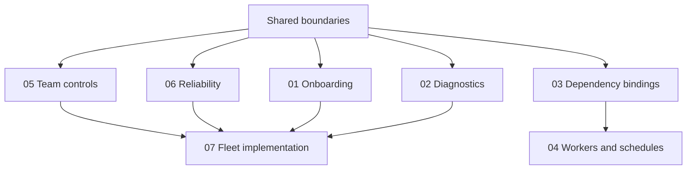

# Envy next-phase product requirements

Status: proposed requirements; no runtime capabilities are enabled by these documents.
Decisions gathered: 23 September 2026.

The product goal is a realistic preview that is easy to create, trust and diagnose.
A platform owner prepares approved applications and infrastructure; developers,
CI and agents then create previews independently. Start with onboarding and
diagnosis, then complete application lifecycles, team operation and fleet management.

## Evidence baseline

Current-state statements were reviewed against commit
`7bc9b27c6a5b540ce92443bf6f6e03245a5dbff3`. Source and test links in each PRD
identify the implementation inspected at that revision. Test existence is evidence
of intended coverage, not a claim that those tests were executed for this
documentation change. Older plans are context, not proof of implementation.

All requirements below are proposed unless a PRD explicitly describes them as
implemented. Mark a milestone delivered only after linking its implementation,
version and passing acceptance evidence. Do not copy proposed capabilities into
the public website's feature claims.

## Read and deliver

Read [Shared product boundaries](product-boundaries.md) first. It defines ownership,
replaceable defaults, compatibility and the common acceptance contract.

| PRD | Independently deliverable first milestone | Later work within the PRD |
| --- | --- | --- |
| [01: Onboarding and preview planning](01-onboarding.md) | Resume preparation, reduce repeated input and review an explicit preview plan | Adopt typed dependency and target contracts as they become available |
| [02: Diagnostics and baseline drift](02-diagnostics.md) | Explain observed blockers and evidence freshness, including baseline drift | Richer external telemetry integrations |
| [03: Dependency bindings](03-dependencies.md) | Gate execution on scoped operator bindings and synthetic acceptance | Additional supported binding adapters |
| [04: Background workloads](04-workloads.md) | Complete the finite-Job lifecycle and prove it in a live synthetic fixture | Workers, then bounded scheduling, with CI/frontend lifecycle integration |
| [05: Team controls](05-team-controls.md) | Enforce project roles, scoped automation and project admission limits | Target-scoped administration when fleet support lands |
| [06: Reliability and bundles](06-reliability-and-bundles.md) | Measure the existing controller and validate recovery | Capacity qualification, then replaceable reference deployment bundles |
| [07: Fleet management](07-fleet-management.md) | Manage independent previews in multiple installations | Additional cloud acceptance; cross-cluster compositions remain excluded |

PRD 04 starts with a small completion gate for existing Jobs; it does not rebuild
them. Workers and scheduling then extend that proven contract. PRD 06 separates
operational instrumentation from bundle packaging so either can be reviewed on
its own.

## Dependencies and order

1. Deliver onboarding and diagnostics first. They consume current observations
   and can report external prerequisites as unknown before PRD 03 exists.
2. Define dependency interfaces before workers and scheduling. Existing finite
   Job acceptance can proceed without waiting for new worker execution.
3. Team permissions and operational recovery gate supported fleet operation.
   Dependency bindings and background workloads are not prerequisites for a
   first HTTP-only fleet release; each target advertises what it supports.
4. Design fleet target identity and scoping early, alongside shared interfaces.
   Do not introduce remote execution until the fleet gates pass.
5. Implementation can proceed independently only against agreed interfaces.
   Each delivery PR names its requirement IDs and acceptance results.

## Requirement-to-acceptance checklist

The checklists in each PRD map every numbered requirement to an observable
scenario. They are intentionally unchecked: this suite does not assert delivery.

| Delivery gate | Requirements | Acceptance checklist |
| --- | --- | --- |
| Shared contract | C-01 through C-08 | [Common acceptance](product-boundaries.md#common-acceptance) |
| Onboarding M1 | ONB-01 through ONB-07 | [Onboarding acceptance](01-onboarding.md#acceptance) |
| Diagnostics M1 | DIA-01 through DIA-07 | [Diagnostics acceptance](02-diagnostics.md#acceptance) |
| Dependency M1 | DEP-01 through DEP-08 | [Dependency acceptance](03-dependencies.md#acceptance) |
| Jobs M1 / workers M2 / schedules M3 | WRK-01 through WRK-08 | [Workload acceptance](04-workloads.md#acceptance) |
| Team controls M1 | TEAM-01 through TEAM-07 | [Team acceptance](05-team-controls.md#acceptance) |
| Operations M1 / scale M2 / bundles M3 | REL-01 through REL-07 | [Reliability acceptance](06-reliability-and-bundles.md#acceptance) |
| Fleet M1 | FLEET-01 through FLEET-09 | [Fleet acceptance](07-fleet-management.md#acceptance) |

For each gate, record synthetic setup, tested revision, result, limitations and
cleanup evidence. Local fixtures cannot certify cloud IAM, a real database wire
protocol or cross-project access. GKE acceptance is required before claiming the
fleet milestone supported; record unavailable cloud acceptance as pending.

## Maintainer handoff

Keep source-grounded current state separate from requirements when updating a
PRD. API work must include the migration, compatibility path and REST/CLI/MCP/UI
behaviour needed for its milestone. Unknown states must not become successful
checks just to simplify a user journey.

Existing [architecture](../architecture.md), [workload planning](../workloads.md)
and [application rollout](../application-rollout-plan.md) remain useful references.
The shared boundaries identify historical ADRs a future implementation must
extend or supersede. This suite does not silently amend those decisions.
