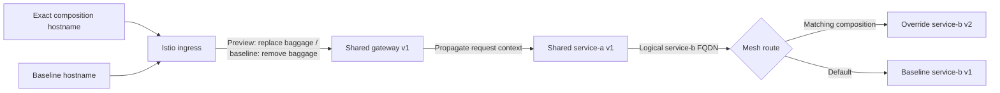

# Request routing

The first provider uses Istio sidecars and `networking.istio.io/v1` Gateway and
VirtualService resources. It needs no Envoy extension, DestinationRule subsets,
or ambient waypoints. HTTP Services declare their protocol; application-encrypted
traffic that proxies cannot inspect is outside this slice.

## Namespace and destination layout

The injected baseline namespace contains the three v1 services. Every
composition owns an injected namespace containing its one to three overrides. Service
selectors are disjoint by namespace and ownership; baseline Services must never
select override pods. Clients keep calling registered baseline Service FQDNs.
The mesh sends matching requests to the override's separate Service FQDN.

One aggregate mesh VirtualService owns each logical overridden baseline host.
It contains all active composition matches, sorted deterministically, followed
by the baseline destination. Never create one mesh VirtualService per
composition for the same host. The routing provider refuses conflicting owners
instead of silently replacing their traffic policy.

An unchanged aggregate snapshot is reconciled once per controller scan. Changed
intent triggers reconciliation again within that scan. Routing observations in
later scans read Istio state afresh to detect drift. A provider error invalidates earlier
observations because some route writes may already have succeeded. Conflict
validation and reconciliation share one VirtualService list; optimistic updates
and identity-checked deletes protect against concurrent changes to those objects.

## Ingress contract

- Baseline URL: `http://baseline.envy.localhost:8080`.
- Preview URL: `http://cmp-<id>.envy.localhost:8080`.
- A preview's exact-host VirtualService **sets** request header
  `baggage: composition=<id>`, replacing untrusted inbound baggage.
- That route sets response header `x-envy-route: <id>`. Cleanup requires a 404
  without this marker before draining: an application can return its own 404
  while the preview route still forwards requests. The marker indicates routing
  through ingress; it is neither authorization nor proof of downstream selection.
- The baseline exact-host route removes all inbound baggage.
- Unknown and destroyed hostnames have no forwarding route and return 404 after
  ingress configuration converges.

Ingress routes directly to the resolved entry Service: the composition override
when its entry component is selected, otherwise the shared baseline entry. Setting baggage does
not run a second route-selection pass at the same ingress. External baggage is
intentionally discarded for this local slice; internal services may add other
members. Public arbitrary-header composition selection is deferred.

The returned URL is the supported lifecycle boundary. After cleanup, direct
internal requests carrying an obsolete composition ID may select the baseline.
Neither baggage nor possession of a hostname grants authorization.

## Context propagation and matching

Every demo service explicitly installs both W3C `TraceContext` and `Baggage`
propagators. `otelhttp` instruments incoming handlers and outgoing transports.
Downstream requests derive from the incoming request's context. No collector is
required to propagate context.

The JSON chain response reports service, version, request-observed composition
ID, workload identity, and downstream response. Composition identity must come
from extracted request baggage, never an environment variable on the workload.
The demo v2 images contain real version changes for gateway, service-a and service-b.

Mesh matching uses an escaped, member-boundary-aware regex for the canonical
composition ID. It supports preceding/following baggage members, optional
whitespace, and member properties. It is not a general-purpose baggage parser.
The supported contract has one composition member, established by ingress
replacement. Unit tests cover exact match, prefix collisions, whitespace,
properties, and unrelated members. Ingress tests cover duplicate and hostile
incoming baggage headers.

## Convergence and cleanup

Configuration acceptance is not proof of proxy convergence. With `envy-chain`,
readiness requires real ingress requests proving the override and baseline chains.
With `http`, readiness requires the configured successful status from both
ingresses; `verification_level: reachability` and `RouteVerified: false` explicitly
leave propagation and workload selection unproven. Application-specific tests
must establish that evidence. Neither contract guarantees a globally atomic cutover.

After an override route is installed, retain it if the workload becomes
unhealthy. An unavailable override should fail visibly instead of succeeding
against baseline. On deletion, remove and verify the hostname first, drain
bounded in-flight requests, then remove aggregate routes and owned workloads.
Bounded polling should inspect actual behavior; fixed sleeps are not readiness.

## References

- [Istio routing best practices](https://istio.io/latest/docs/ops/best-practices/traffic-management/)
- [VirtualService API](https://istio.io/latest/docs/reference/config/networking/virtual-service/)
- [Istio protocol selection](https://istio.io/latest/docs/ops/configuration/traffic-management/protocol-selection/)
- [OpenTelemetry propagation](https://opentelemetry.io/docs/specs/otel/context/api-propagators/)
- [Go HTTP instrumentation](https://pkg.go.dev/go.opentelemetry.io/contrib/instrumentation/net/http/otelhttp)
- [W3C Baggage](https://www.w3.org/TR/baggage/)
