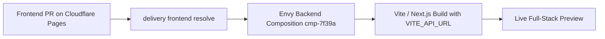

Envy allows frontend pull requests (deployed via **Cloudflare Pages**, **Vercel**, or **Netlify**) to bind directly to a dedicated backend microservice composition.

---

## Why Bind Frontends to Backend Compositions?

In modern web applications, frontend teams frequently need to test against unmerged backend API changes. Rather than pointing the frontend at a fragile shared environment or mocking backend endpoints, Envy dynamically resolves the live backend preview URL during the frontend build.



---

## The Build Step (`cloudflare-pages.sh`)

In your Cloudflare Pages build settings or deployment script:

```bash
#!/usr/bin/env bash
set -euo pipefail

# 1. Capture current Git commit SHA
REVISION=$(git rev-parse HEAD)

# 2. Bind frontend revision to backend composition
delivery frontend bind \
  --project shop \
  --frontend storefront-web \
  --revision "$REVISION" \
  --composition "$ENVY_COMPOSITION_ID" \
  --repository "https://github.com/org/storefront"

# 3. Resolve the public backend API URL (waiting up to 60s for readiness)
RESOLVED_OUTPUT=$(delivery frontend resolve \
  --project shop \
  --frontend storefront-web \
  --revision "$REVISION" \
  --timeout 60s \
  --json)

export VITE_API_BASE_URL=$(echo "$RESOLVED_OUTPUT" | jq -r '.api_url')

# 4. Run frontend build with the dynamically resolved API URL
pnpm build
```

---

## Submitting Automated Browser Test Evidence

After Cloudflare Pages finishes deployment, your CI or agent can execute Playwright / Cypress browser checks and submit the verification record back to Envy:

```bash
delivery frontend check \
  --project shop \
  --frontend storefront-web \
  --revision "$REVISION" \
  --expected-version 1 \
  --composition-generation 1 \
  --status passed \
  --message "All 24 checkout flow E2E specs passed in headless Chrome."
```

Envy stores these check results transactionally in PostgreSQL and renders them on the composition's inspect dashboard in the Web UI.
