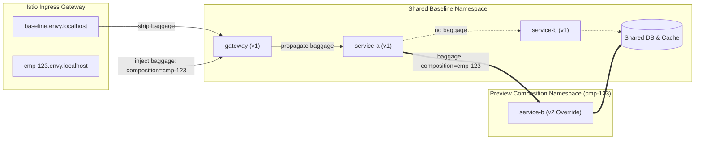

Envy separates administrative intent from data-plane execution. It persists state in **PostgreSQL** and reconciles desired state into **Kubernetes** and **Istio** without ever proxying application payloads.

---

## High-Level Topology

```text
┌────────────────────────────────────────────────────────┐
│                      Control Plane                     │
│                                                        │
│  Developer / CI / AI Agent                             │
│        │                                               │
│        ▼                                               │
│   REST API  ◄───  Private Client  ◄───  MCP Server     │
│        │                                               │
│        ▼                                               │
│   PostgreSQL (State, Locks, Idempotency, Audit Events) │
│        ▲                                               │
│        │  (Advisory Lock Scan)                         │
│   Reconciler Loop                                      │
│        │                                               │
└────────┼───────────────────────────────────────────────┘
         │
         ▼
┌────────────────────────────────────────────────────────┐
│                 Data Plane (Kubernetes)                │
│                                                        │
│   Istio Ingress Gateway (Allocates hostnames & baggage)│
│        │                                               │
│        ▼                                               │
│   Shared Baseline Workloads ──► Istio Mesh Routing     │
│                                        │               │
│                                        ▼               │
│                              Override Workload Pods    │
│                              (Isolated Namespace)      │
└────────────────────────────────────────────────────────┘
```

---

## Control Plane Architecture

The control plane comprises four core layers:

1. **REST API (`internal/api`)**:
   - Authenticated HTTP interface (`Authorization: Bearer <token>`).
   - Validates client payloads, handles optional `Idempotency-Key` headers, and enforces generation constraints.
   - Writes desired state to PostgreSQL and returns `202 Accepted` with a polling `Location` header.

2. **Model Context Protocol Adapter (`internal/mcp`)**:
   - Thin stdio server that translates MCP tool calls (`create_composition`, `get_composition`, etc.) into requests handled by Envy's HTTP client.
   - Requires zero Kubernetes credentials or cluster-admin permissions.

3. **PostgreSQL Persistence Layer (`internal/persistence/postgres`)**:
   - Persistent store for all compositions, operations, idempotency records, and audit events.
   - Compiled with `sqlc` for zero-allocation, type-safe query execution.
   - One active reconciler worker holds a PostgreSQL transaction-safe advisory lock to ensure single-leader consistency.

4. **Reconciler Worker (`internal/reconciler`)**:
   - Polls durable state and converges Kubernetes and Istio objects to match client intent.
   - Reconciles workloads via the Kubernetes provider and routes via the Istio provider.
   - Executes real ingress verification checks (`internal/verification`) to confirm live traffic routing before marking a composition `ready`.

---

## Data Plane & Routing Mechanics

### Ingress Routing Contract

When a composition is created, Envy registers two endpoints with the Istio Ingress Gateway:

- **Baseline Ingress**:
  - Hostname: `http://baseline.envy.localhost:8080`
  - Ingress Behavior: Explicitly **strips** any inbound `baggage` headers to prevent context spoofing.
- **Composition Preview Ingress**:
  - Hostname: `http://cmp-<id>.envy.localhost:8080`
  - Ingress Behavior: **Sets** the request header `baggage: composition=<id>`.
  - Ingress Response Marker: Sets `x-envy-route: <id>`.



### Context Propagation (W3C Baggage)

Envy uses standard W3C Distributed Tracing and Baggage specifications. Microservices in the chain derive outgoing baggage from the incoming HTTP request:

```http
GET /orders HTTP/1.1
Host: service-b.default.svc.cluster.local:8080
baggage: composition=cmp-7f39a
traceparent: 00-4bf92f3577b34da6a3ce929d0e0e4736-00f067aa0ba902b7-01
```

Because context propagation is handled at the network level by Envoy sidecars, microservices do not need proprietary SDKs or control-plane connections.

---

## Resiliency Guarantees

- **Wire-Speed Execution**: Envy’s control plane is entirely out-of-band. Once Istio routes are configured, application traffic flows directly through Envoy proxies.
- **Surviving Restarts**: If the Envy control plane process restarts or crashes, running compositions continue serving preview traffic without interruption.
- **Deterministic Teardown**: Deletion intent is persisted transactionally. The reconciler verifies that Istio returns a clean 404 (without the `x-envy-route` header) before draining and deleting pod workloads.
