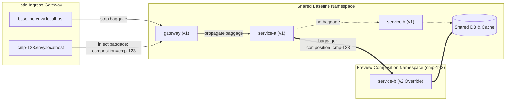

Envy relies on standard Istio sidecars and `networking.istio.io/v1` Gateway and VirtualService resources. It does not require custom Envoy extensions, DestinationRule subsets, or ambient waypoints.

---

## Network Topology



---

## Ingress Contract

1. **Baseline URL**:
   `http://baseline.envy.localhost:8080`
   - The exact-host route unconditionally **removes all inbound baggage** to prevent callers from spoofing composition identifiers.

2. **Composition Preview URL**:
   `http://cmp-<id>.envy.localhost:8080`
   - Ingress matches the exact preview hostname and **sets** request header:
     `baggage: composition=<id>`
   - Ingress sets the response header:
     `x-envy-route: <id>`

3. **Teardown Verification**:
   - Cleanup requires observing an HTTP 404 response without the `x-envy-route` header before pod workloads are drained. This guarantees that traffic has ceased before Kubernetes terminates the containers.

---

## Mesh Destination Routing

Microservices in the cluster continue calling ordinary Kubernetes Service FQDNs (e.g. `http://service-b.default.svc.cluster.local:8080`).

Envy configures **one aggregate mesh VirtualService** for each overridden baseline host:

```yaml
apiVersion: networking.istio.io/v1
kind: VirtualService
metadata:
  name: envy-mesh-service-b
  namespace: envy-baseline
spec:
  hosts:
    - service-b.default.svc.cluster.local
  http:
    # 1. Match composition cmp-7f39a baggage
    - match:
        - headers:
            baggage:
              regex: ".*composition=cmp-7f39a.*"
      route:
        - destination:
            host: service-b.envy-cmp-7f39a.svc.cluster.local
            port:
              number: 8080

    # 2. Default route: fall through to shared baseline
    - route:
        - destination:
            host: service-b.envy-baseline.svc.cluster.local
            port:
              number: 8080
```

---

## Context Propagation

Applications in the mesh must propagate the incoming W3C `baggage` header when making downstream HTTP calls. In Go, this is achieved in one line using OpenTelemetry's `otelhttp` transport:

```go
import (
    "go.opentelemetry.io/contrib/instrumentation/net/http/otelhttp"
    "go.opentelemetry.io/otel"
    "go.opentelemetry.io/otel/propagation"
)

func init() {
    // Install standard W3C propagators globally
    otel.SetTextMapPropagator(propagation.NewCompositeTextMapPropagator(
        propagation.TraceContext{},
        propagation.Baggage{},
    ))
}
```
